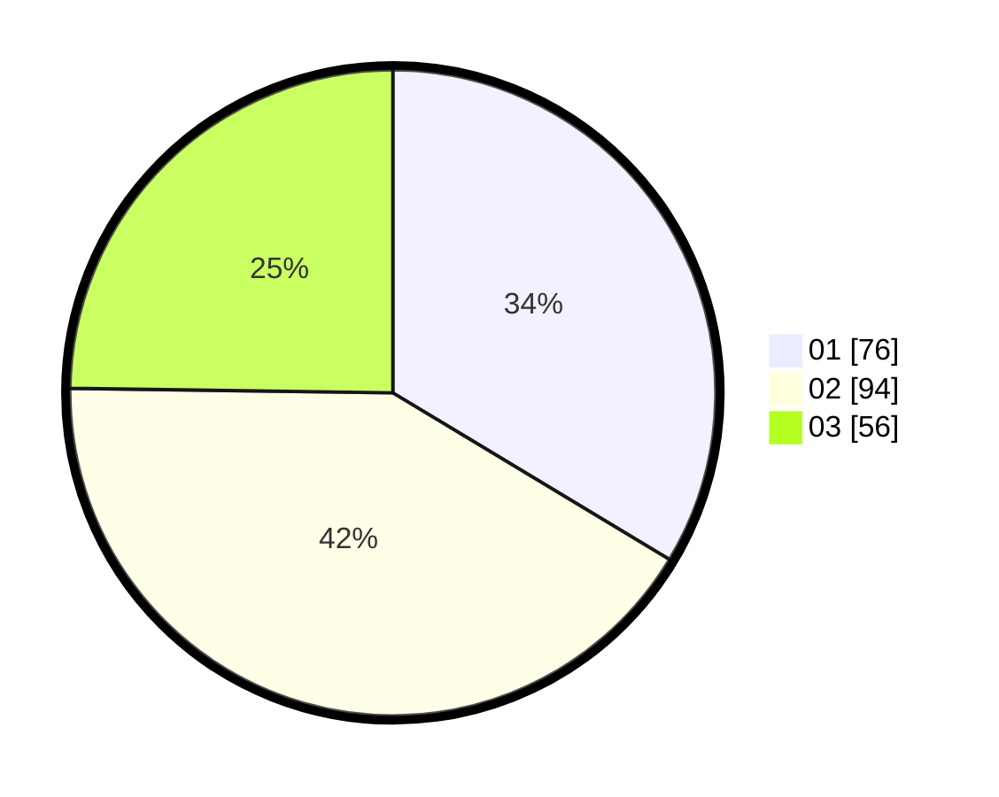

# Hasil

Hasil perolehan suara paslon dapat dilihat pada file paslon-01.txt, paslon-02.txt, dan paslon-03.txt.

Jika tidak ada, artinya data tersebut belum ada pada SIREKAP.

## Perolehan Suara

 * Paslon 01: **76**.
 * Paslon 02: **94**.
 * Paslon 03: **56**.

## Foto C Plano

https://sirekap-obj-formc.kpu.go.id/07f4/pemilu/ppwp/31/73/05/10/07/3173051007095-20240216-231500--bce79e1c-124b-4ad4-9c35-96bca27146bf.jpg

https://sirekap-obj-formc.kpu.go.id/07f4/pemilu/ppwp/31/73/05/10/07/3173051007095-20240216-231502--0afd47d2-60f5-4dba-9238-fb5d0e5cdf02.jpg

https://sirekap-obj-formc.kpu.go.id/07f4/pemilu/ppwp/31/73/05/10/07/3173051007095-20240216-231501--077a9ca5-e6da-45b8-ab48-ff461fd6c637.jpg

## DATA PEMILIH TETAP

Jumlah pemilih dalam DPT: **280**.
 * L: **136**.
 * P: **144**.

## DATA PENGGUNA HAK PILIH

Jumlah pengguna hak pilih dalam DPT: **216**.
 * L: **103**.
 * P: **113**.

Jumlah pengguna hak pilih dalam DPTb: **16**.
 * L: **9**.
 * P: **7**.

Jumlah pengguna hak pilih dalam DPK: **0**.
 * L: **0**.
 * P: **0**.

Jumlah pengguna hak pilih: **232**.
 * L: **112**.
 * P: **120**.

## JUMLAH SUARA SAH DAN TIDAK SAH

JUMLAH SELURUH SUARA SAH: **226**.

JUMLAH SUARA TIDAK SAH: **6**.

JUMLAH SELURUH SUARA SAH DAN SUARA TIDAK SAH: **232**.
