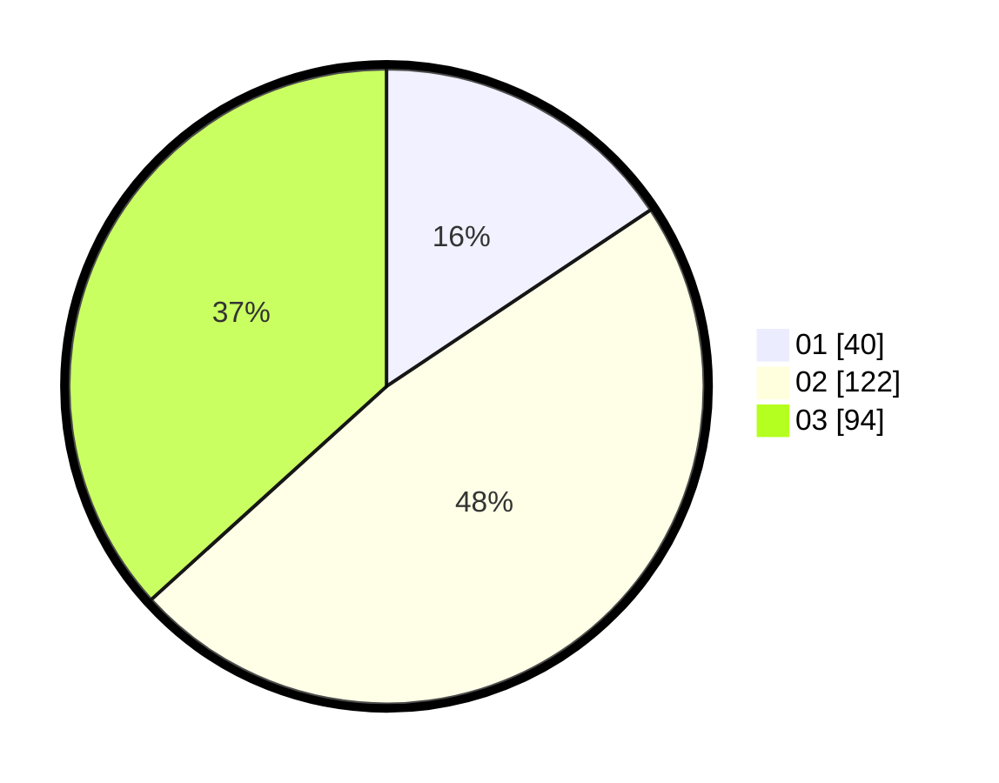

# Hasil

Hasil perolehan suara paslon dapat dilihat pada file paslon-01.txt, paslon-02.txt, dan paslon-03.txt.

Jika tidak ada, artinya data tersebut belum ada pada SIREKAP.

## Perolehan Suara

 * Paslon 01: **40**.
 * Paslon 02: **122**.
 * Paslon 03: **94**.

## Foto C Plano

https://sirekap-obj-formc.kpu.go.id/40a3/pemilu/ppwp/31/73/05/10/07/3173051007102-20240219-182303--1be4db09-4204-4f68-8b37-fe55b51b212b.jpg

https://sirekap-obj-formc.kpu.go.id/40a3/pemilu/ppwp/31/73/05/10/07/3173051007102-20240219-182305--dfb80666-41ae-4a40-b615-5fd3441f8949.jpg

https://sirekap-obj-formc.kpu.go.id/40a3/pemilu/ppwp/31/73/05/10/07/3173051007102-20240219-182304--ed5371f8-021b-470a-bfd5-07a2952f1fcc.jpg

## DATA PEMILIH TETAP

Jumlah pemilih dalam DPT: **0**.
 * L: **0**.
 * P: **0**.

## DATA PENGGUNA HAK PILIH

Jumlah pengguna hak pilih dalam DPT: **0**.
 * L: **0**.
 * P: **0**.

Jumlah pengguna hak pilih dalam DPTb: **0**.
 * L: **0**.
 * P: **0**.

Jumlah pengguna hak pilih dalam DPK: **0**.
 * L: **0**.
 * P: **0**.

Jumlah pengguna hak pilih: **0**.
 * L: **0**.
 * P: **0**.

## JUMLAH SUARA SAH DAN TIDAK SAH

JUMLAH SELURUH SUARA SAH: **256**.

JUMLAH SUARA TIDAK SAH: **4**.

JUMLAH SELURUH SUARA SAH DAN SUARA TIDAK SAH: **260**.
