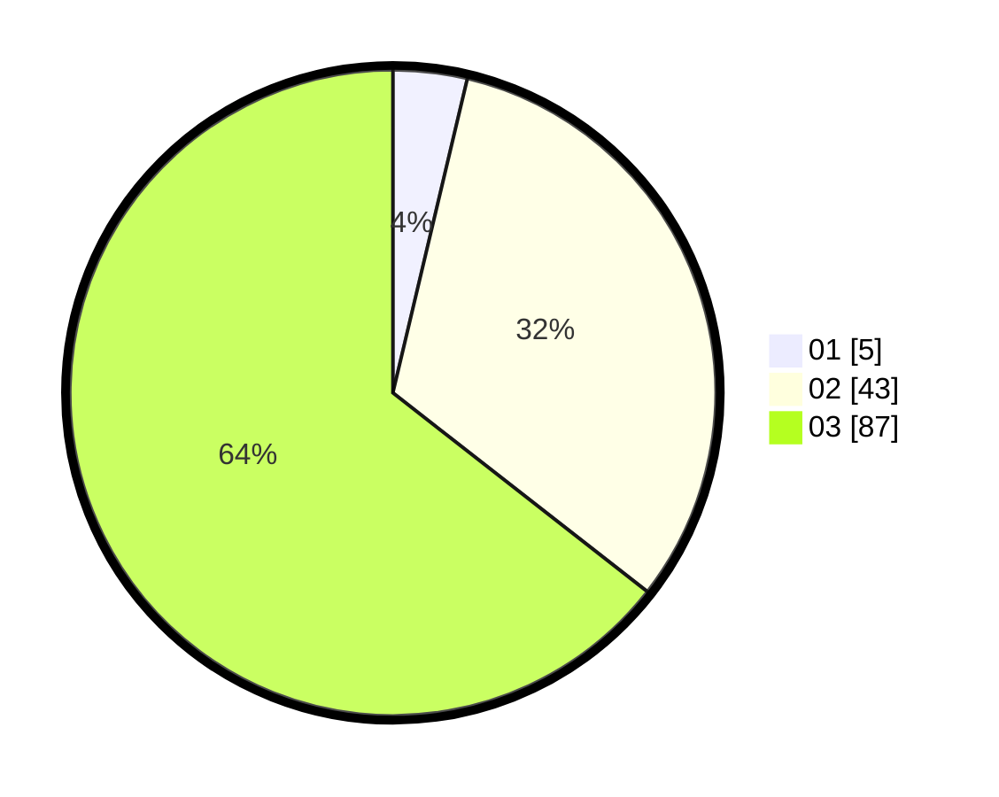

# Hasil

Hasil perolehan suara paslon dapat dilihat pada file paslon-01.txt, paslon-02.txt, dan paslon-03.txt.

Jika tidak ada, artinya data tersebut belum ada pada SIREKAP.

## Perolehan Suara

 * Paslon 01: **5**.
 * Paslon 02: **43**.
 * Paslon 03: **87**.

## Foto C Plano

https://sirekap-obj-formc.kpu.go.id/e508/pemilu/ppwp/31/73/05/10/07/3173051007107-20240215-221958--53937fbd-8c57-4cea-a92a-031da97ce508.jpg

https://sirekap-obj-formc.kpu.go.id/e508/pemilu/ppwp/31/73/05/10/07/3173051007107-20240215-221959--5af287b5-42bf-4fca-8b27-d986d0b4c37a.jpg

https://sirekap-obj-formc.kpu.go.id/e508/pemilu/ppwp/31/73/05/10/07/3173051007107-20240215-221958--234bf2b6-3c2e-4950-a581-672c63b29ea1.jpg

## DATA PEMILIH TETAP

Jumlah pemilih dalam DPT: **173**.
 * L: **85**.
 * P: **88**.

## DATA PENGGUNA HAK PILIH

Jumlah pengguna hak pilih dalam DPT: **125**.
 * L: **63**.
 * P: **62**.

Jumlah pengguna hak pilih dalam DPTb: **11**.
 * L: **4**.
 * P: **7**.

Jumlah pengguna hak pilih dalam DPK: **2**.
 * L: **1**.
 * P: **1**.

Jumlah pengguna hak pilih: **138**.
 * L: **68**.
 * P: **70**.

## JUMLAH SUARA SAH DAN TIDAK SAH

JUMLAH SELURUH SUARA SAH: **135**.

JUMLAH SUARA TIDAK SAH: **3**.

JUMLAH SELURUH SUARA SAH DAN SUARA TIDAK SAH: **138**.
