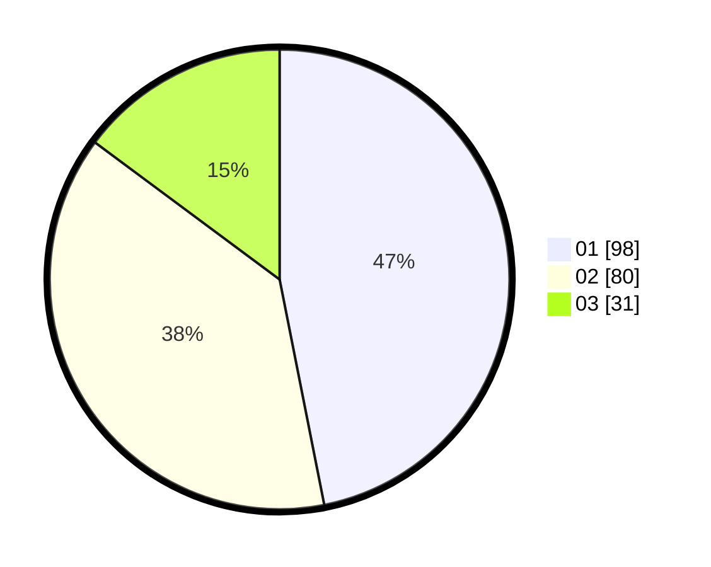

# Hasil

Hasil perolehan suara paslon dapat dilihat pada file paslon-01.txt, paslon-02.txt, dan paslon-03.txt.

Jika tidak ada, artinya data tersebut belum ada pada SIREKAP.

## Perolehan Suara

 * Paslon 01: **98**.
 * Paslon 02: **80**.
 * Paslon 03: **31**.

## Foto C Plano

https://sirekap-obj-formc.kpu.go.id/119e/pemilu/ppwp/31/73/06/10/01/3173061001002-20240214-211658--9ca86706-5e08-4833-a3da-60672c754b0f.jpg

https://sirekap-obj-formc.kpu.go.id/119e/pemilu/ppwp/31/73/06/10/01/3173061001002-20240214-211947--2d5926b3-2e82-47f2-aaa5-7994c5517ffb.jpg

https://sirekap-obj-formc.kpu.go.id/119e/pemilu/ppwp/31/73/06/10/01/3173061001002-20240214-212238--8e8ae117-4599-43cd-99ff-c559dfe8b87e.jpg

## DATA PEMILIH TETAP

Jumlah pemilih dalam DPT: **285**.
 * L: **143**.
 * P: **142**.

## DATA PENGGUNA HAK PILIH

Jumlah pengguna hak pilih dalam DPT: **208**.
 * L: **101**.
 * P: **107**.

Jumlah pengguna hak pilih dalam DPTb: **2**.
 * L: **1**.
 * P: **1**.

Jumlah pengguna hak pilih dalam DPK: **0**.
 * L: **0**.
 * P: **0**.

Jumlah pengguna hak pilih: **210**.
 * L: **102**.
 * P: **108**.

## JUMLAH SUARA SAH DAN TIDAK SAH

JUMLAH SELURUH SUARA SAH: **209**.

JUMLAH SUARA TIDAK SAH: **1**.

JUMLAH SELURUH SUARA SAH DAN SUARA TIDAK SAH: **210**.
