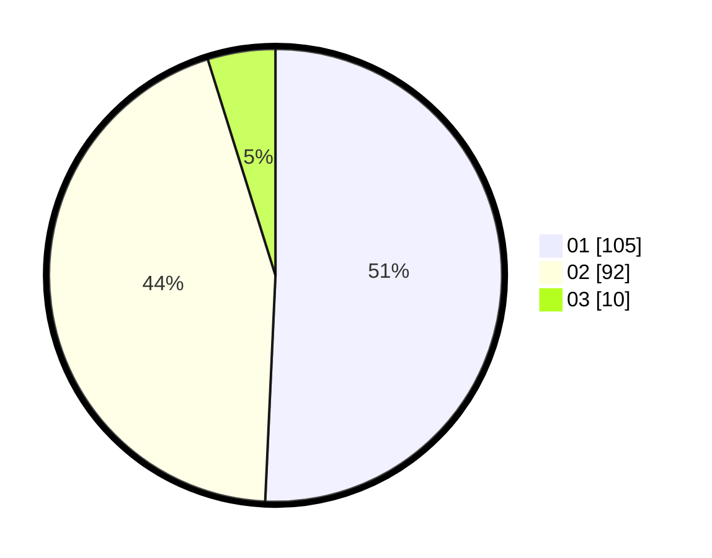

# Hasil

Hasil perolehan suara paslon dapat dilihat pada file paslon-01.txt, paslon-02.txt, dan paslon-03.txt.

Jika tidak ada, artinya data tersebut belum ada pada SIREKAP.

## Perolehan Suara

 * Paslon 01: **105**.
 * Paslon 02: **92**.
 * Paslon 03: **10**.

## Foto C Plano

https://sirekap-obj-formc.kpu.go.id/030c/pemilu/ppwp/31/73/06/10/01/3173061001004-20240216-021225--f578e59d-ef69-4387-be46-ed44e0e8574b.jpg

https://sirekap-obj-formc.kpu.go.id/030c/pemilu/ppwp/31/73/06/10/01/3173061001004-20240214-194941--87d8cf12-4d3e-49a6-bd70-180184d5aa9a.jpg

https://sirekap-obj-formc.kpu.go.id/030c/pemilu/ppwp/31/73/06/10/01/3173061001004-20240216-021226--add2926c-949d-453f-aeee-d5a72bd3c94b.jpg

## DATA PEMILIH TETAP

Jumlah pemilih dalam DPT: **0**.
 * L: **0**.
 * P: **0**.

## DATA PENGGUNA HAK PILIH

Jumlah pengguna hak pilih dalam DPT: **0**.
 * L: **0**.
 * P: **0**.

Jumlah pengguna hak pilih dalam DPTb: **0**.
 * L: **0**.
 * P: **0**.

Jumlah pengguna hak pilih dalam DPK: **0**.
 * L: **0**.
 * P: **0**.

Jumlah pengguna hak pilih: **0**.
 * L: **0**.
 * P: **0**.

## JUMLAH SUARA SAH DAN TIDAK SAH

JUMLAH SELURUH SUARA SAH: **0**.

JUMLAH SUARA TIDAK SAH: **0**.

JUMLAH SELURUH SUARA SAH DAN SUARA TIDAK SAH: **0**.
