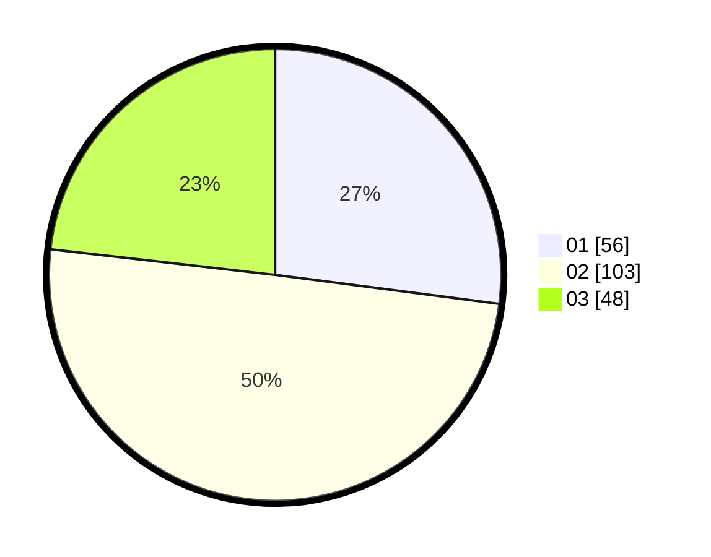

# Hasil

Hasil perolehan suara paslon dapat dilihat pada file paslon-01.txt, paslon-02.txt, dan paslon-03.txt.

Jika tidak ada, artinya data tersebut belum ada pada SIREKAP.

## Perolehan Suara

 * Paslon 01: **56**.
 * Paslon 02: **103**.
 * Paslon 03: **48**.

## Foto C Plano

https://sirekap-obj-formc.kpu.go.id/1341/pemilu/ppwp/31/73/06/10/01/3173061001005-20240216-154137--f3b8b68e-d9a2-411c-82ca-7723ea5ad487.jpg

https://sirekap-obj-formc.kpu.go.id/1341/pemilu/ppwp/31/73/06/10/01/3173061001005-20240216-154138--3589e606-2785-440a-a356-046fb1d70c09.jpg

https://sirekap-obj-formc.kpu.go.id/1341/pemilu/ppwp/31/73/06/10/01/3173061001005-20240214-231310--a8f2ac41-058d-4342-a97c-790e59aee2c2.jpg

## DATA PEMILIH TETAP

Jumlah pemilih dalam DPT: **266**.
 * L: **134**.
 * P: **132**.

## DATA PENGGUNA HAK PILIH

Jumlah pengguna hak pilih dalam DPT: **207**.
 * L: **103**.
 * P: **104**.

Jumlah pengguna hak pilih dalam DPTb: **0**.
 * L: **0**.
 * P: **0**.

Jumlah pengguna hak pilih dalam DPK: **3**.
 * L: **2**.
 * P: **1**.

Jumlah pengguna hak pilih: **210**.
 * L: **105**.
 * P: **105**.

## JUMLAH SUARA SAH DAN TIDAK SAH

JUMLAH SELURUH SUARA SAH: **207**.

JUMLAH SUARA TIDAK SAH: **3**.

JUMLAH SELURUH SUARA SAH DAN SUARA TIDAK SAH: **210**.
