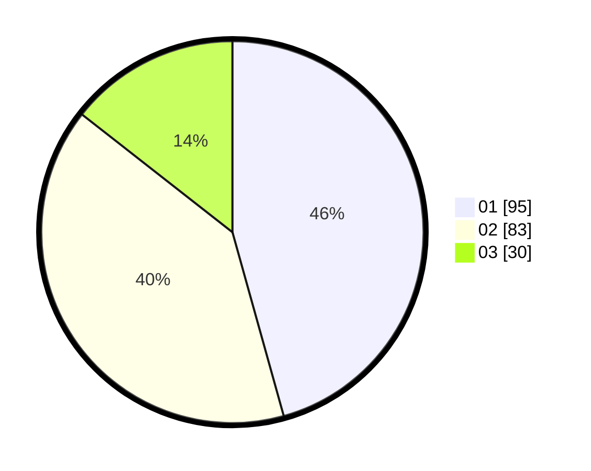

# Hasil

Hasil perolehan suara paslon dapat dilihat pada file paslon-01.txt, paslon-02.txt, dan paslon-03.txt.

Jika tidak ada, artinya data tersebut belum ada pada SIREKAP.

## Perolehan Suara

 * Paslon 01: **95**.
 * Paslon 02: **83**.
 * Paslon 03: **30**.

## Foto C Plano

https://sirekap-obj-formc.kpu.go.id/5d80/pemilu/ppwp/31/73/06/10/01/3173061001006-20240214-155229--a553b713-17a7-4d37-bc72-4b0b0389ab97.jpg

https://sirekap-obj-formc.kpu.go.id/5d80/pemilu/ppwp/31/73/06/10/01/3173061001006-20240214-155241--1686c77f-77f1-4fc5-a17d-fdb143cbfbea.jpg
