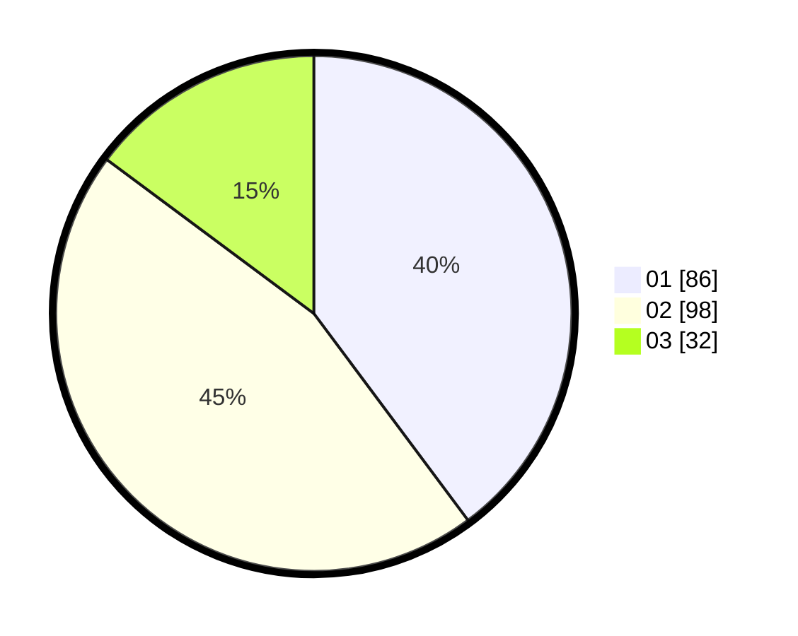

# Hasil

Hasil perolehan suara paslon dapat dilihat pada file paslon-01.txt, paslon-02.txt, dan paslon-03.txt.

Jika tidak ada, artinya data tersebut belum ada pada SIREKAP.

## Perolehan Suara

 * Paslon 01: **86**.
 * Paslon 02: **98**.
 * Paslon 03: **32**.

## Foto C Plano

https://sirekap-obj-formc.kpu.go.id/d307/pemilu/ppwp/31/73/06/10/01/3173061001007-20240214-230908--215bada4-ca24-4c85-9697-9d765ed827a5.jpg

https://sirekap-obj-formc.kpu.go.id/d307/pemilu/ppwp/31/73/06/10/01/3173061001007-20240214-230946--f9f2a339-619b-45de-869a-40db515d472d.jpg

https://sirekap-obj-formc.kpu.go.id/d307/pemilu/ppwp/31/73/06/10/01/3173061001007-20240214-231016--45eb05bb-a5d5-40d1-943a-a4bce3d7cd1e.jpg

## DATA PEMILIH TETAP

Jumlah pemilih dalam DPT: **268**.
 * L: **142**.
 * P: **126**.

## DATA PENGGUNA HAK PILIH

Jumlah pengguna hak pilih dalam DPT: **218**.
 * L: **109**.
 * P: **109**.

Jumlah pengguna hak pilih dalam DPTb: **0**.
 * L: **0**.
 * P: **0**.

Jumlah pengguna hak pilih dalam DPK: **0**.
 * L: **0**.
 * P: **0**.

Jumlah pengguna hak pilih: **218**.
 * L: **109**.
 * P: **109**.

## JUMLAH SUARA SAH DAN TIDAK SAH

JUMLAH SELURUH SUARA SAH: **216**.

JUMLAH SUARA TIDAK SAH: **2**.

JUMLAH SELURUH SUARA SAH DAN SUARA TIDAK SAH: **218**.
