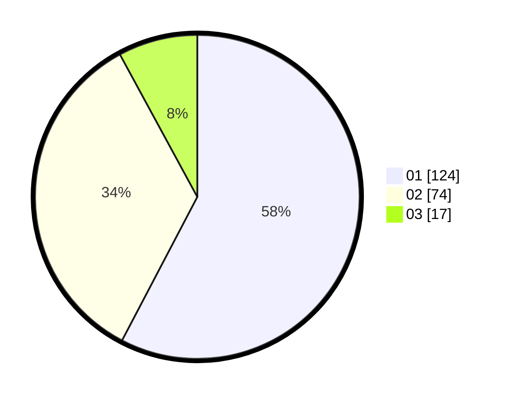

# Hasil

Hasil perolehan suara paslon dapat dilihat pada file paslon-01.txt, paslon-02.txt, dan paslon-03.txt.

Jika tidak ada, artinya data tersebut belum ada pada SIREKAP.

## Perolehan Suara

 * Paslon 01: **124**.
 * Paslon 02: **74**.
 * Paslon 03: **17**.

## Foto C Plano

https://sirekap-obj-formc.kpu.go.id/241d/pemilu/ppwp/31/73/06/10/01/3173061001015-20240214-222418--3d23d3f7-8794-4d15-a346-1f362eae4e74.jpg

https://sirekap-obj-formc.kpu.go.id/241d/pemilu/ppwp/31/73/06/10/01/3173061001015-20240214-184836--31fa0bad-c326-4433-9025-cfaf30d9a724.jpg

https://sirekap-obj-formc.kpu.go.id/241d/pemilu/ppwp/31/73/06/10/01/3173061001015-20240214-184841--052ddec8-09dc-4dde-9ebf-6cd1e0df8b8b.jpg

## DATA PEMILIH TETAP

Jumlah pemilih dalam DPT: **245**.
 * L: **120**.
 * P: **125**.

## DATA PENGGUNA HAK PILIH

Jumlah pengguna hak pilih dalam DPT: **214**.
 * L: **104**.
 * P: **110**.

Jumlah pengguna hak pilih dalam DPTb: **0**.
 * L: **0**.
 * P: **0**.

Jumlah pengguna hak pilih dalam DPK: **2**.
 * L: **0**.
 * P: **2**.

Jumlah pengguna hak pilih: **216**.
 * L: **104**.
 * P: **112**.

## JUMLAH SUARA SAH DAN TIDAK SAH

JUMLAH SELURUH SUARA SAH: **215**.

JUMLAH SUARA TIDAK SAH: **2**.

JUMLAH SELURUH SUARA SAH DAN SUARA TIDAK SAH: **217**.
