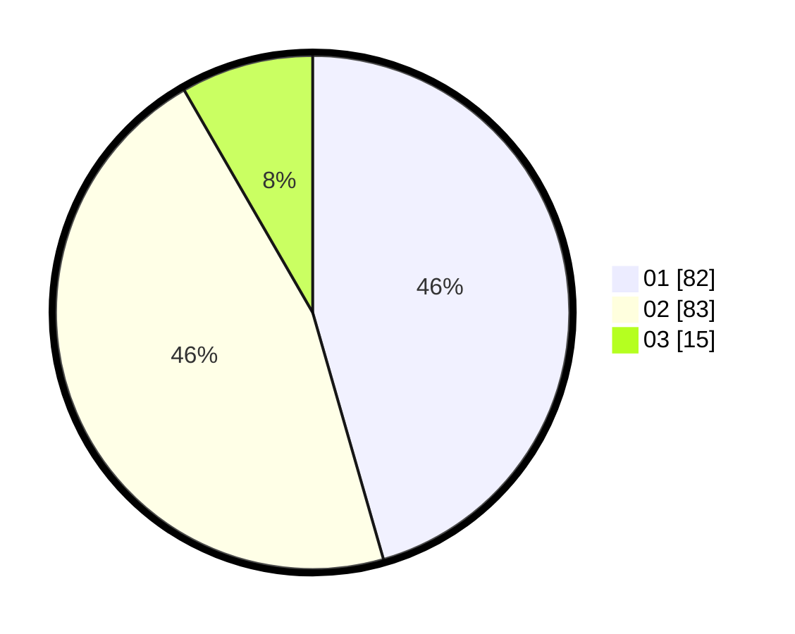

# Hasil

Hasil perolehan suara paslon dapat dilihat pada file paslon-01.txt, paslon-02.txt, dan paslon-03.txt.

Jika tidak ada, artinya data tersebut belum ada pada SIREKAP.

## Perolehan Suara

 * Paslon 01: **82**.
 * Paslon 02: **83**.
 * Paslon 03: **15**.

## Foto C Plano

https://sirekap-obj-formc.kpu.go.id/7435/pemilu/ppwp/31/73/06/10/01/3173061001017-20240219-204240--a15e99d9-94d8-47e0-93b6-de5be36de035.jpg

https://sirekap-obj-formc.kpu.go.id/7435/pemilu/ppwp/31/73/06/10/01/3173061001017-20240219-205555--e3be1b25-d997-4b77-93c3-06c6483d629a.jpg

https://sirekap-obj-formc.kpu.go.id/7435/pemilu/ppwp/31/73/06/10/01/3173061001017-20240219-205225--70bae9d0-11d6-4e9e-a285-1419bb6905f1.jpg

## DATA PEMILIH TETAP

Jumlah pemilih dalam DPT: **239**.
 * L: **116**.
 * P: **123**.

## DATA PENGGUNA HAK PILIH

Jumlah pengguna hak pilih dalam DPT: **181**.
 * L: **89**.
 * P: **92**.

Jumlah pengguna hak pilih dalam DPTb: **0**.
 * L: **0**.
 * P: **0**.

Jumlah pengguna hak pilih dalam DPK: **4**.
 * L: **3**.
 * P: **1**.

Jumlah pengguna hak pilih: **185**.
 * L: **92**.
 * P: **93**.

## JUMLAH SUARA SAH DAN TIDAK SAH

JUMLAH SELURUH SUARA SAH: **180**.

JUMLAH SUARA TIDAK SAH: **5**.

JUMLAH SELURUH SUARA SAH DAN SUARA TIDAK SAH: **185**.
