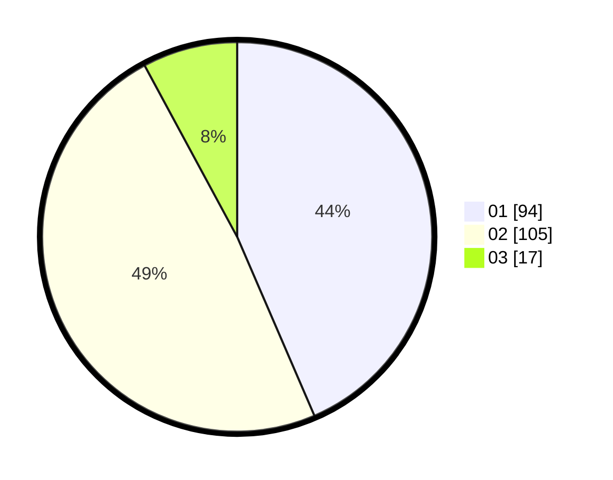

# Hasil

Hasil perolehan suara paslon dapat dilihat pada file paslon-01.txt, paslon-02.txt, dan paslon-03.txt.

Jika tidak ada, artinya data tersebut belum ada pada SIREKAP.

## Perolehan Suara

 * Paslon 01: **94**.
 * Paslon 02: **105**.
 * Paslon 03: **17**.

## Foto C Plano

https://sirekap-obj-formc.kpu.go.id/b1b9/pemilu/ppwp/31/73/06/10/01/3173061001018-20240215-005015--9e01e44a-b631-4187-884c-e79b3b25c0f3.jpg

https://sirekap-obj-formc.kpu.go.id/b1b9/pemilu/ppwp/31/73/06/10/01/3173061001018-20240215-010655--54d75681-4ccc-4882-a0dd-8e944e524c5e.jpg

https://sirekap-obj-formc.kpu.go.id/b1b9/pemilu/ppwp/31/73/06/10/01/3173061001018-20240215-010731--56d7650f-2639-469a-9966-cf4bdac54667.jpg
