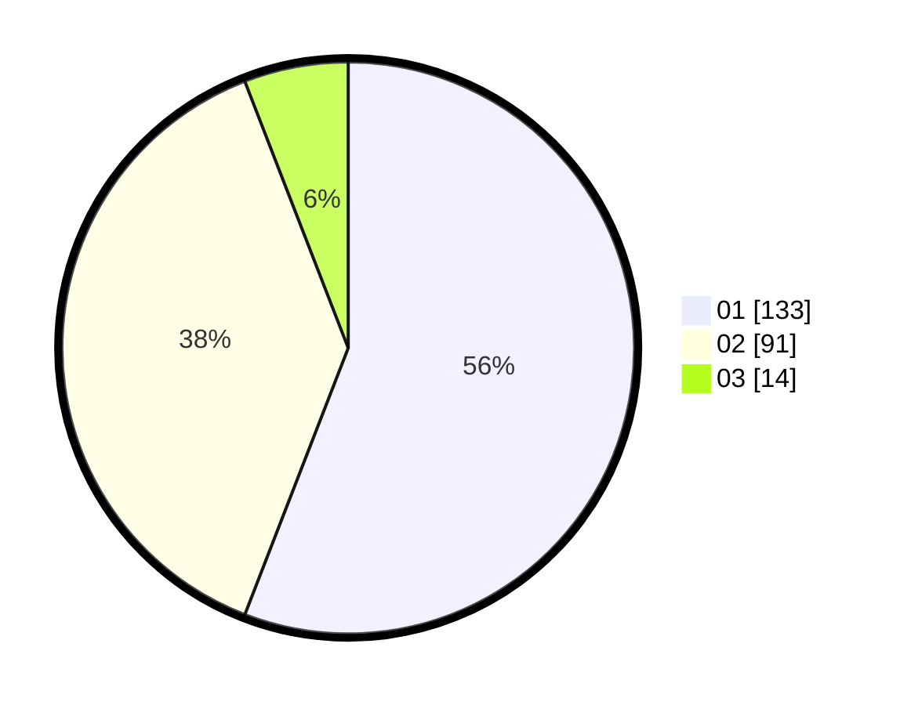

# Hasil

Hasil perolehan suara paslon dapat dilihat pada file paslon-01.txt, paslon-02.txt, dan paslon-03.txt.

Jika tidak ada, artinya data tersebut belum ada pada SIREKAP.

## Perolehan Suara

 * Paslon 01: **133**.
 * Paslon 02: **91**.
 * Paslon 03: **14**.

## Foto C Plano

https://sirekap-obj-formc.kpu.go.id/6e8c/pemilu/ppwp/31/73/06/10/01/3173061001019-20240215-204800--50d83c0f-7d5a-4c24-ab0e-015380c33171.jpg

https://sirekap-obj-formc.kpu.go.id/6e8c/pemilu/ppwp/31/73/06/10/01/3173061001019-20240215-204802--7e5f22d0-beea-40a5-be79-77a63a55644b.jpg

https://sirekap-obj-formc.kpu.go.id/6e8c/pemilu/ppwp/31/73/06/10/01/3173061001019-20240215-204801--90be9b9c-fc31-4ea5-8073-42280478a66a.jpg

## DATA PEMILIH TETAP

Jumlah pemilih dalam DPT: **278**.
 * L: **134**.
 * P: **144**.

## DATA PENGGUNA HAK PILIH

Jumlah pengguna hak pilih dalam DPT: **235**.
 * L: **115**.
 * P: **120**.

Jumlah pengguna hak pilih dalam DPTb: **4**.
 * L: **2**.
 * P: **2**.

Jumlah pengguna hak pilih dalam DPK: **2**.
 * L: **0**.
 * P: **2**.

Jumlah pengguna hak pilih: **241**.
 * L: **117**.
 * P: **124**.

## JUMLAH SUARA SAH DAN TIDAK SAH

JUMLAH SELURUH SUARA SAH: **238**.

JUMLAH SUARA TIDAK SAH: **3**.

JUMLAH SELURUH SUARA SAH DAN SUARA TIDAK SAH: **241**.
