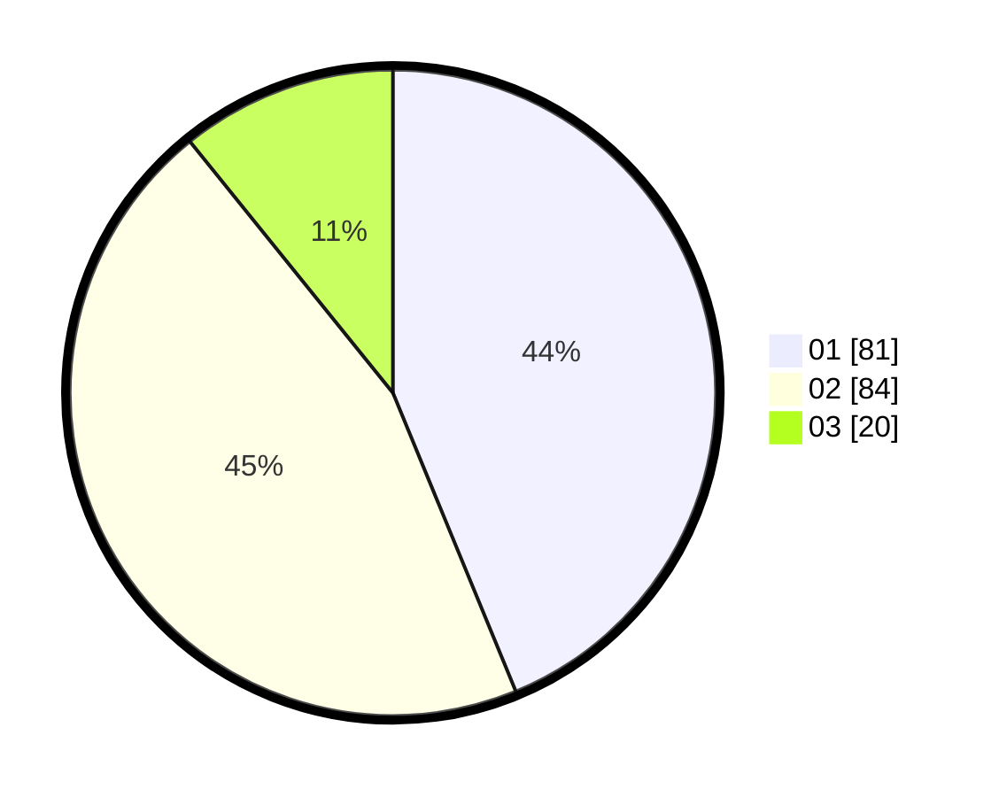

# Hasil

Hasil perolehan suara paslon dapat dilihat pada file paslon-01.txt, paslon-02.txt, dan paslon-03.txt.

Jika tidak ada, artinya data tersebut belum ada pada SIREKAP.

## Perolehan Suara

 * Paslon 01: **81**.
 * Paslon 02: **84**.
 * Paslon 03: **20**.

## Foto C Plano

https://sirekap-obj-formc.kpu.go.id/9639/pemilu/ppwp/31/73/06/10/01/3173061001024-20240214-191949--128fda9b-88b9-4f31-ac86-8ab3a94f829d.jpg

https://sirekap-obj-formc.kpu.go.id/9639/pemilu/ppwp/31/73/06/10/01/3173061001024-20240214-200407--9cdca716-4675-4d88-9574-d49e1656b23b.jpg

https://sirekap-obj-formc.kpu.go.id/9639/pemilu/ppwp/31/73/06/10/01/3173061001024-20240214-200537--07c5cd69-9752-45c3-9e0b-92c8e22d0c6e.jpg

## DATA PEMILIH TETAP

Jumlah pemilih dalam DPT: **256**.
 * L: **122**.
 * P: **134**.

## DATA PENGGUNA HAK PILIH

Jumlah pengguna hak pilih dalam DPT: **186**.
 * L: **91**.
 * P: **95**.

Jumlah pengguna hak pilih dalam DPTb: **0**.
 * L: **0**.
 * P: **0**.

Jumlah pengguna hak pilih dalam DPK: **0**.
 * L: **0**.
 * P: **0**.

Jumlah pengguna hak pilih: **186**.
 * L: **91**.
 * P: **95**.

## JUMLAH SUARA SAH DAN TIDAK SAH

JUMLAH SELURUH SUARA SAH: **185**.

JUMLAH SUARA TIDAK SAH: **1**.

JUMLAH SELURUH SUARA SAH DAN SUARA TIDAK SAH: **185**.
