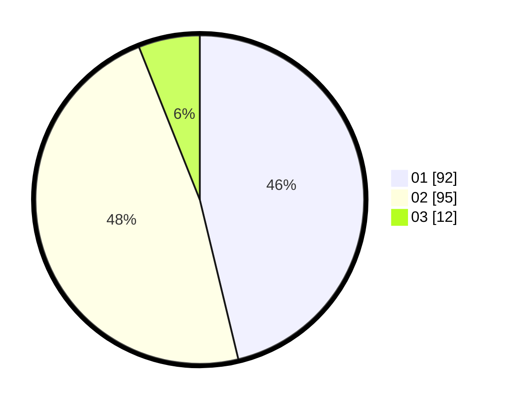

# Hasil

Hasil perolehan suara paslon dapat dilihat pada file paslon-01.txt, paslon-02.txt, dan paslon-03.txt.

Jika tidak ada, artinya data tersebut belum ada pada SIREKAP.

## Perolehan Suara

 * Paslon 01: **92**.
 * Paslon 02: **95**.
 * Paslon 03: **12**.

## Foto C Plano

https://sirekap-obj-formc.kpu.go.id/cf91/pemilu/ppwp/31/73/06/10/01/3173061001025-20240216-001341--dc6f72aa-5eff-47ea-abd7-deeb1b8899cc.jpg

https://sirekap-obj-formc.kpu.go.id/cf91/pemilu/ppwp/31/73/06/10/01/3173061001025-20240216-001342--d407edbd-7c07-4abf-b611-1a8d9348921c.jpg

https://sirekap-obj-formc.kpu.go.id/cf91/pemilu/ppwp/31/73/06/10/01/3173061001025-20240216-001342--8cc7e0ad-f3ff-4f56-bbaa-a610276aa90d.jpg

## DATA PEMILIH TETAP

Jumlah pemilih dalam DPT: **241**.
 * L: **117**.
 * P: **124**.

## DATA PENGGUNA HAK PILIH

Jumlah pengguna hak pilih dalam DPT: **191**.
 * L: **99**.
 * P: **92**.

Jumlah pengguna hak pilih dalam DPTb: **9**.
 * L: **4**.
 * P: **5**.

Jumlah pengguna hak pilih dalam DPK: **1**.
 * L: **1**.
 * P: **0**.

Jumlah pengguna hak pilih: **201**.
 * L: **104**.
 * P: **96**.

## JUMLAH SUARA SAH DAN TIDAK SAH

JUMLAH SELURUH SUARA SAH: **199**.

JUMLAH SUARA TIDAK SAH: **2**.

JUMLAH SELURUH SUARA SAH DAN SUARA TIDAK SAH: **201**.
