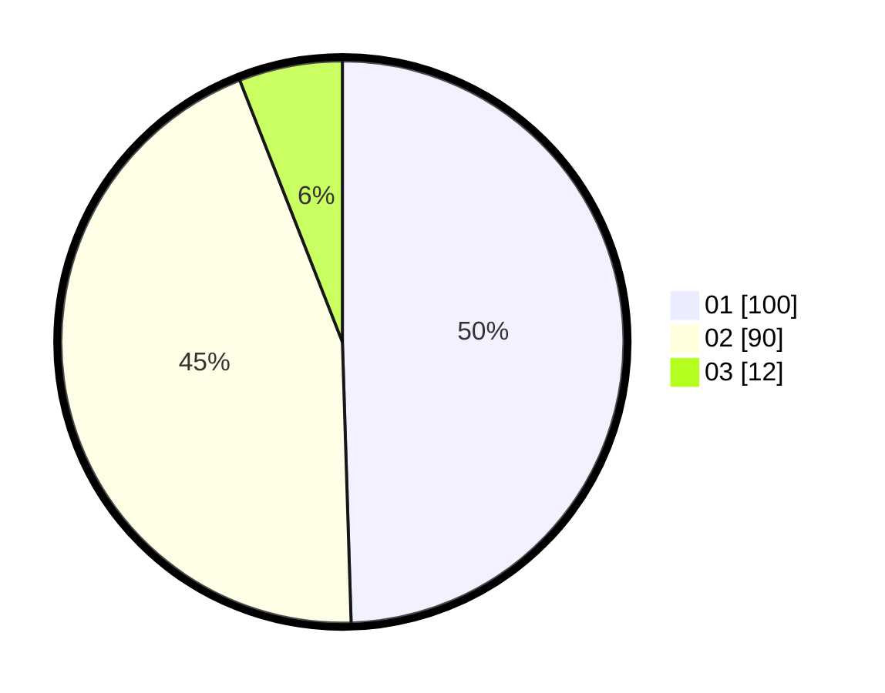

# Hasil

Hasil perolehan suara paslon dapat dilihat pada file paslon-01.txt, paslon-02.txt, dan paslon-03.txt.

Jika tidak ada, artinya data tersebut belum ada pada SIREKAP.

## Perolehan Suara

 * Paslon 01: **100**.
 * Paslon 02: **90**.
 * Paslon 03: **12**.

## Foto C Plano

https://sirekap-obj-formc.kpu.go.id/baff/pemilu/ppwp/31/73/06/10/01/3173061001026-20240215-212428--df83e2c4-88db-4e81-90a0-767a79b686a2.jpg

https://sirekap-obj-formc.kpu.go.id/baff/pemilu/ppwp/31/73/06/10/01/3173061001026-20240215-212430--8571ee22-14b0-45f9-b8a4-b9d53152a88d.jpg

https://sirekap-obj-formc.kpu.go.id/baff/pemilu/ppwp/31/73/06/10/01/3173061001026-20240215-212430--f85c6325-7f4f-4b28-aad6-7fc145b41f95.jpg

## DATA PEMILIH TETAP

Jumlah pemilih dalam DPT: **236**.
 * L: **124**.
 * P: **112**.

## DATA PENGGUNA HAK PILIH

Jumlah pengguna hak pilih dalam DPT: **196**.
 * L: **96**.
 * P: **100**.

Jumlah pengguna hak pilih dalam DPTb: **6**.
 * L: **2**.
 * P: **4**.

Jumlah pengguna hak pilih dalam DPK: **1**.
 * L: **0**.
 * P: **1**.

Jumlah pengguna hak pilih: **203**.
 * L: **98**.
 * P: **105**.

## JUMLAH SUARA SAH DAN TIDAK SAH

JUMLAH SELURUH SUARA SAH: **202**.

JUMLAH SUARA TIDAK SAH: **1**.

JUMLAH SELURUH SUARA SAH DAN SUARA TIDAK SAH: **203**.
