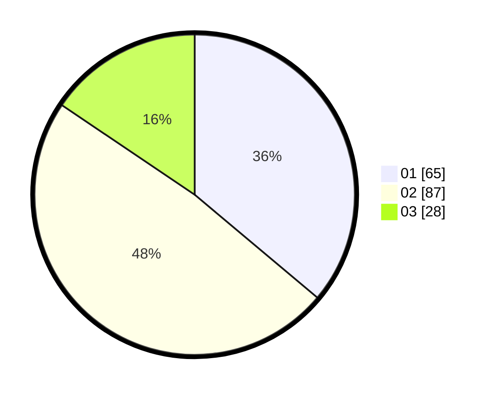

# Hasil

Hasil perolehan suara paslon dapat dilihat pada file paslon-01.txt, paslon-02.txt, dan paslon-03.txt.

Jika tidak ada, artinya data tersebut belum ada pada SIREKAP.

## Perolehan Suara

 * Paslon 01: **65**.
 * Paslon 02: **87**.
 * Paslon 03: **28**.

## Foto C Plano

https://sirekap-obj-formc.kpu.go.id/8655/pemilu/ppwp/31/73/06/10/01/3173061001027-20240215-002224--dee2ee8d-4362-4ff7-ab80-db57eea7c446.jpg

https://sirekap-obj-formc.kpu.go.id/8655/pemilu/ppwp/31/73/06/10/01/3173061001027-20240215-002326--8a9e2815-a5ec-46d9-836e-19f020c3699c.jpg

https://sirekap-obj-formc.kpu.go.id/8655/pemilu/ppwp/31/73/06/10/01/3173061001027-20240215-002409--a9725dde-4e12-4c52-8652-58c0e5a30012.jpg
