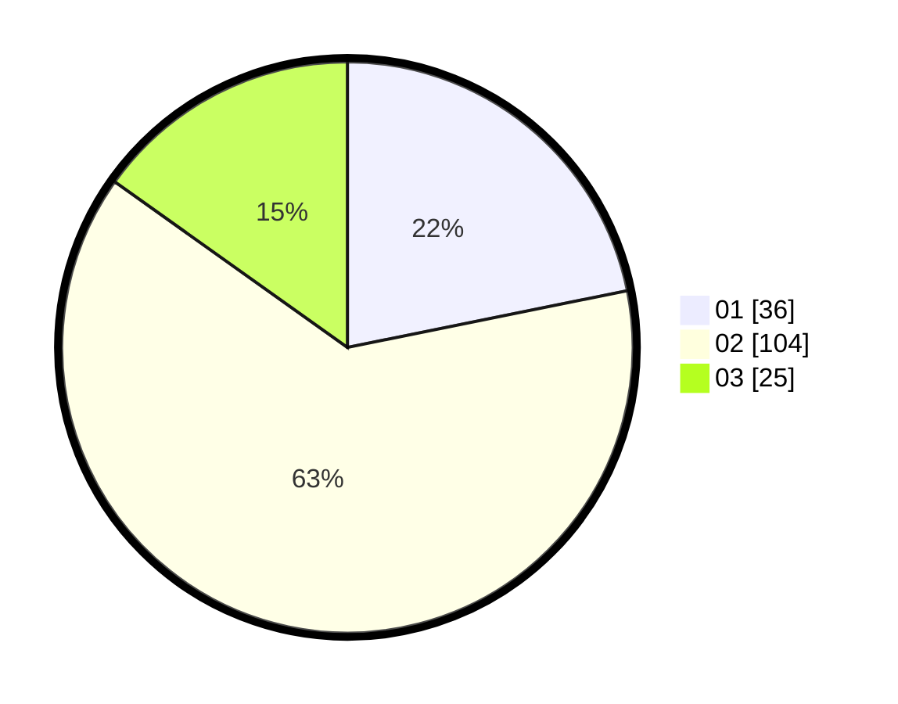

# Hasil

Hasil perolehan suara paslon dapat dilihat pada file paslon-01.txt, paslon-02.txt, dan paslon-03.txt.

Jika tidak ada, artinya data tersebut belum ada pada SIREKAP.

## Perolehan Suara

 * Paslon 01: **36**.
 * Paslon 02: **104**.
 * Paslon 03: **25**.

## Foto C Plano

https://sirekap-obj-formc.kpu.go.id/ea19/pemilu/ppwp/31/73/06/10/01/3173061001030-20240214-181232--7ae62ba9-338e-4e6b-b7b7-c82205f5beeb.jpg

https://sirekap-obj-formc.kpu.go.id/ea19/pemilu/ppwp/31/73/06/10/01/3173061001030-20240214-190230--87460a77-1b02-4259-9e5a-a5245bea589e.jpg

https://sirekap-obj-formc.kpu.go.id/ea19/pemilu/ppwp/31/73/06/10/01/3173061001030-20240214-185609--259e3987-5797-4af5-9213-b04aa937bb1d.jpg

## DATA PEMILIH TETAP

Jumlah pemilih dalam DPT: **205**.
 * L: **77**.
 * P: **128**.

## DATA PENGGUNA HAK PILIH

Jumlah pengguna hak pilih dalam DPT: **161**.
 * L: **56**.
 * P: **105**.

Jumlah pengguna hak pilih dalam DPTb: **3**.
 * L: **0**.
 * P: **3**.

Jumlah pengguna hak pilih dalam DPK: **1**.
 * L: **0**.
 * P: **1**.

Jumlah pengguna hak pilih: **165**.
 * L: **56**.
 * P: **109**.

## JUMLAH SUARA SAH DAN TIDAK SAH

JUMLAH SELURUH SUARA SAH: **165**.

JUMLAH SUARA TIDAK SAH: **0**.

JUMLAH SELURUH SUARA SAH DAN SUARA TIDAK SAH: **165**.
