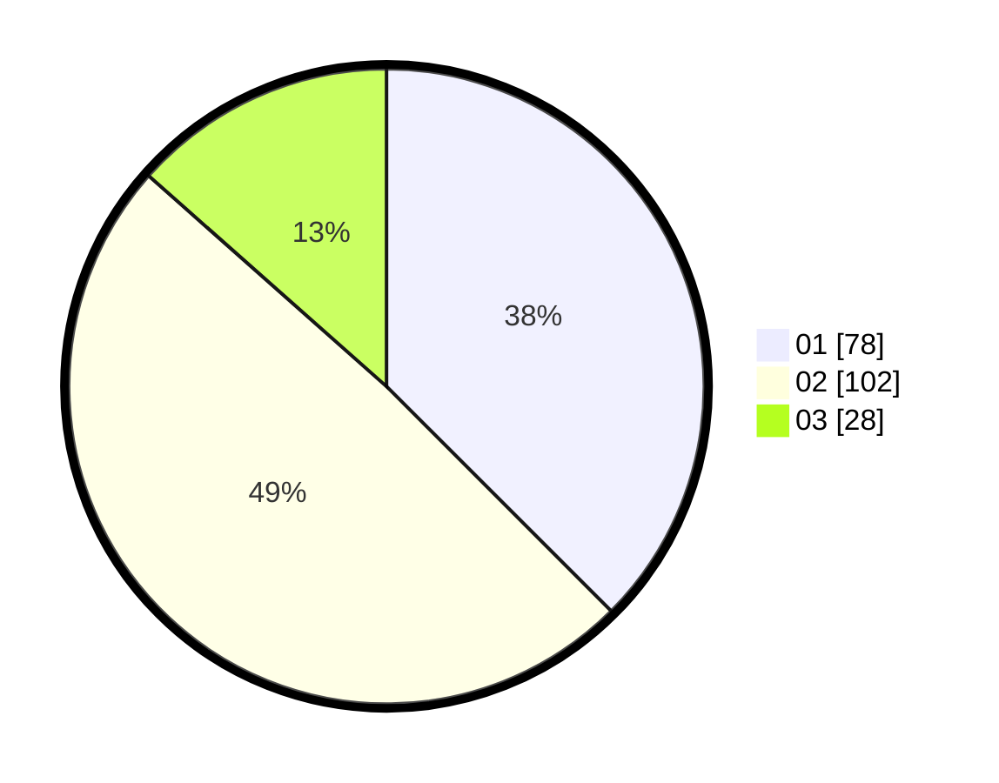

# Hasil

Hasil perolehan suara paslon dapat dilihat pada file paslon-01.txt, paslon-02.txt, dan paslon-03.txt.

Jika tidak ada, artinya data tersebut belum ada pada SIREKAP.

## Perolehan Suara

 * Paslon 01: **78**.
 * Paslon 02: **102**.
 * Paslon 03: **28**.

## Foto C Plano

https://sirekap-obj-formc.kpu.go.id/862f/pemilu/ppwp/31/73/06/10/01/3173061001032-20240216-003606--248cb641-d6c8-44e9-94c2-2ee18edbb80a.jpg

https://sirekap-obj-formc.kpu.go.id/862f/pemilu/ppwp/31/73/06/10/01/3173061001032-20240216-003616--d22559db-646a-4c90-aab0-8be27d971f4c.jpg

https://sirekap-obj-formc.kpu.go.id/862f/pemilu/ppwp/31/73/06/10/01/3173061001032-20240216-003611--cda9ea51-9cd8-4f4e-ad09-027f3cece678.jpg

## DATA PEMILIH TETAP

Jumlah pemilih dalam DPT: **282**.
 * L: **141**.
 * P: **141**.

## DATA PENGGUNA HAK PILIH

Jumlah pengguna hak pilih dalam DPT: **202**.
 * L: **102**.
 * P: **100**.

Jumlah pengguna hak pilih dalam DPTb: **1**.
 * L: **0**.
 * P: **1**.

Jumlah pengguna hak pilih dalam DPK: **7**.
 * L: **4**.
 * P: **3**.

Jumlah pengguna hak pilih: **210**.
 * L: **106**.
 * P: **104**.

## JUMLAH SUARA SAH DAN TIDAK SAH

JUMLAH SELURUH SUARA SAH: **208**.

JUMLAH SUARA TIDAK SAH: **2**.

JUMLAH SELURUH SUARA SAH DAN SUARA TIDAK SAH: **210**.
