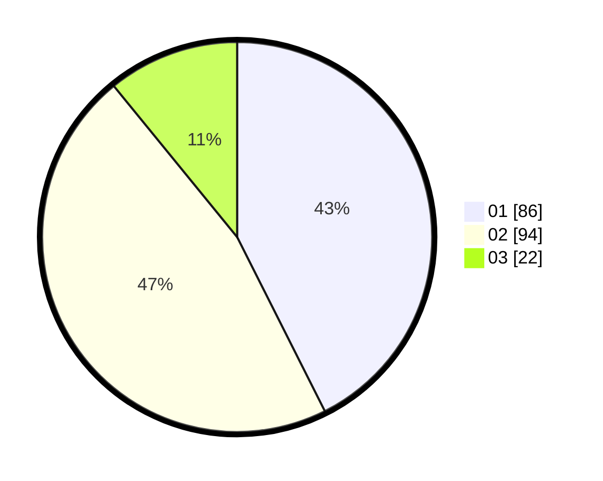

# Hasil

Hasil perolehan suara paslon dapat dilihat pada file paslon-01.txt, paslon-02.txt, dan paslon-03.txt.

Jika tidak ada, artinya data tersebut belum ada pada SIREKAP.

## Perolehan Suara

 * Paslon 01: **86**.
 * Paslon 02: **94**.
 * Paslon 03: **22**.

## Foto C Plano

https://sirekap-obj-formc.kpu.go.id/49cc/pemilu/ppwp/31/73/06/10/01/3173061001033-20240214-155438--73401902-00e4-478a-be82-8bbbaf62958d.jpg

https://sirekap-obj-formc.kpu.go.id/49cc/pemilu/ppwp/31/73/06/10/01/3173061001033-20240214-141851--22283c1c-f0f5-4433-bb6f-e4982661e936.jpg

https://sirekap-obj-formc.kpu.go.id/49cc/pemilu/ppwp/31/73/06/10/01/3173061001033-20240215-163524--39068f4e-656d-401a-b769-6bd620689579.jpg

## DATA PEMILIH TETAP

Jumlah pemilih dalam DPT: **278**.
 * L: **149**.
 * P: **129**.

## DATA PENGGUNA HAK PILIH

Jumlah pengguna hak pilih dalam DPT: **201**.
 * L: **104**.
 * P: **97**.

Jumlah pengguna hak pilih dalam DPTb: **2**.
 * L: **0**.
 * P: **2**.

Jumlah pengguna hak pilih dalam DPK: **1**.
 * L: **0**.
 * P: **1**.

Jumlah pengguna hak pilih: **204**.
 * L: **104**.
 * P: **100**.

## JUMLAH SUARA SAH DAN TIDAK SAH

JUMLAH SELURUH SUARA SAH: **202**.

JUMLAH SUARA TIDAK SAH: **2**.

JUMLAH SELURUH SUARA SAH DAN SUARA TIDAK SAH: **204**.
