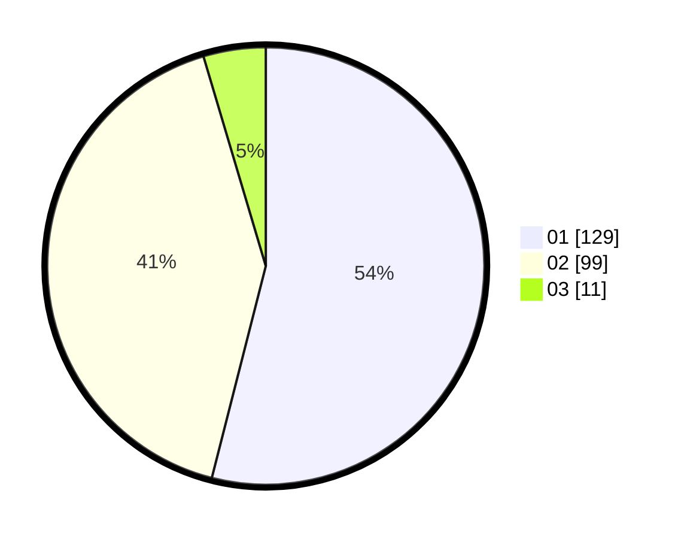

# Hasil

Hasil perolehan suara paslon dapat dilihat pada file paslon-01.txt, paslon-02.txt, dan paslon-03.txt.

Jika tidak ada, artinya data tersebut belum ada pada SIREKAP.

## Perolehan Suara

 * Paslon 01: **129**.
 * Paslon 02: **99**.
 * Paslon 03: **11**.

## Foto C Plano

https://sirekap-obj-formc.kpu.go.id/6105/pemilu/ppwp/31/73/06/10/01/3173061001034-20240215-005548--a181ac53-9610-4e2f-bd74-eb997b82a580.jpg

https://sirekap-obj-formc.kpu.go.id/6105/pemilu/ppwp/31/73/06/10/01/3173061001034-20240215-005556--d967155e-c043-43a6-9a51-6a35679b8c09.jpg
