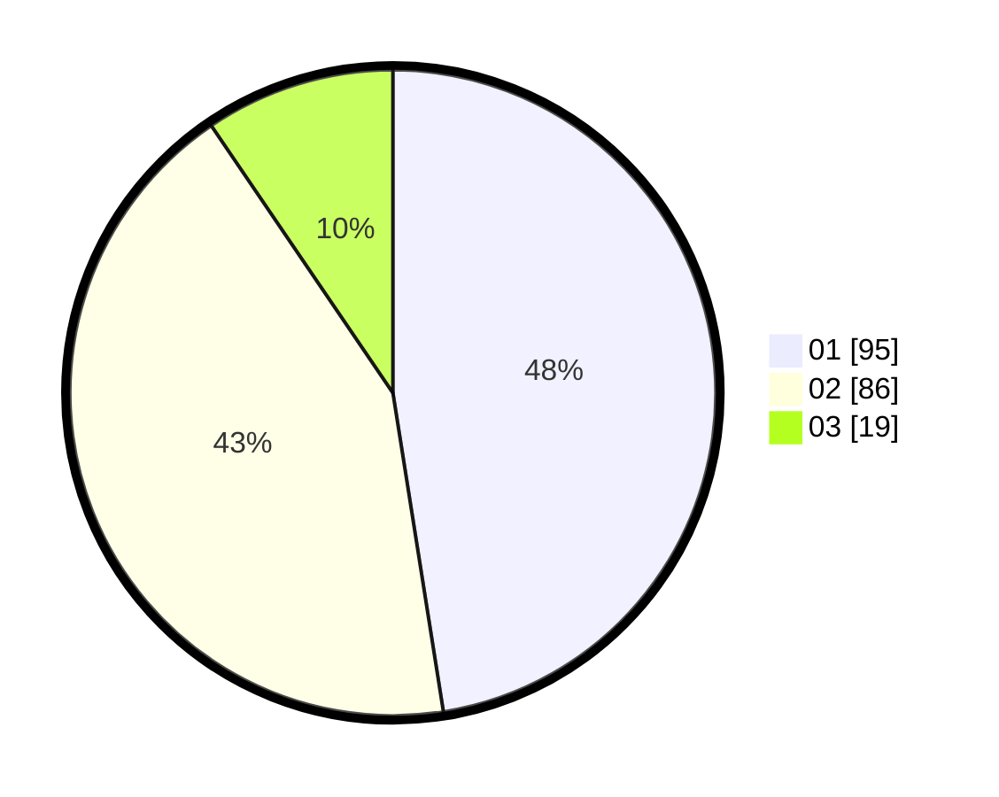

# Hasil

Hasil perolehan suara paslon dapat dilihat pada file paslon-01.txt, paslon-02.txt, dan paslon-03.txt.

Jika tidak ada, artinya data tersebut belum ada pada SIREKAP.

## Perolehan Suara

 * Paslon 01: **95**.
 * Paslon 02: **86**.
 * Paslon 03: **19**.

## Foto C Plano

https://sirekap-obj-formc.kpu.go.id/e4eb/pemilu/ppwp/31/73/06/10/01/3173061001035-20240214-191717--fff05999-1c41-4b4d-b27f-19f18a846438.jpg

https://sirekap-obj-formc.kpu.go.id/e4eb/pemilu/ppwp/31/73/06/10/01/3173061001035-20240214-194544--b4f621a6-4ad1-4275-b056-d3f73aed14d2.jpg

https://sirekap-obj-formc.kpu.go.id/e4eb/pemilu/ppwp/31/73/06/10/01/3173061001035-20240214-192050--f60a37a0-8924-4e83-8054-96298f9721fa.jpg

## DATA PEMILIH TETAP

Jumlah pemilih dalam DPT: **279**.
 * L: **142**.
 * P: **137**.

## DATA PENGGUNA HAK PILIH

Jumlah pengguna hak pilih dalam DPT: **200**.
 * L: **99**.
 * P: **101**.

Jumlah pengguna hak pilih dalam DPTb: **0**.
 * L: **0**.
 * P: **0**.

Jumlah pengguna hak pilih dalam DPK: **3**.
 * L: **1**.
 * P: **2**.

Jumlah pengguna hak pilih: **203**.
 * L: **100**.
 * P: **103**.

## JUMLAH SUARA SAH DAN TIDAK SAH

JUMLAH SELURUH SUARA SAH: **200**.

JUMLAH SUARA TIDAK SAH: **3**.

JUMLAH SELURUH SUARA SAH DAN SUARA TIDAK SAH: **203**.
