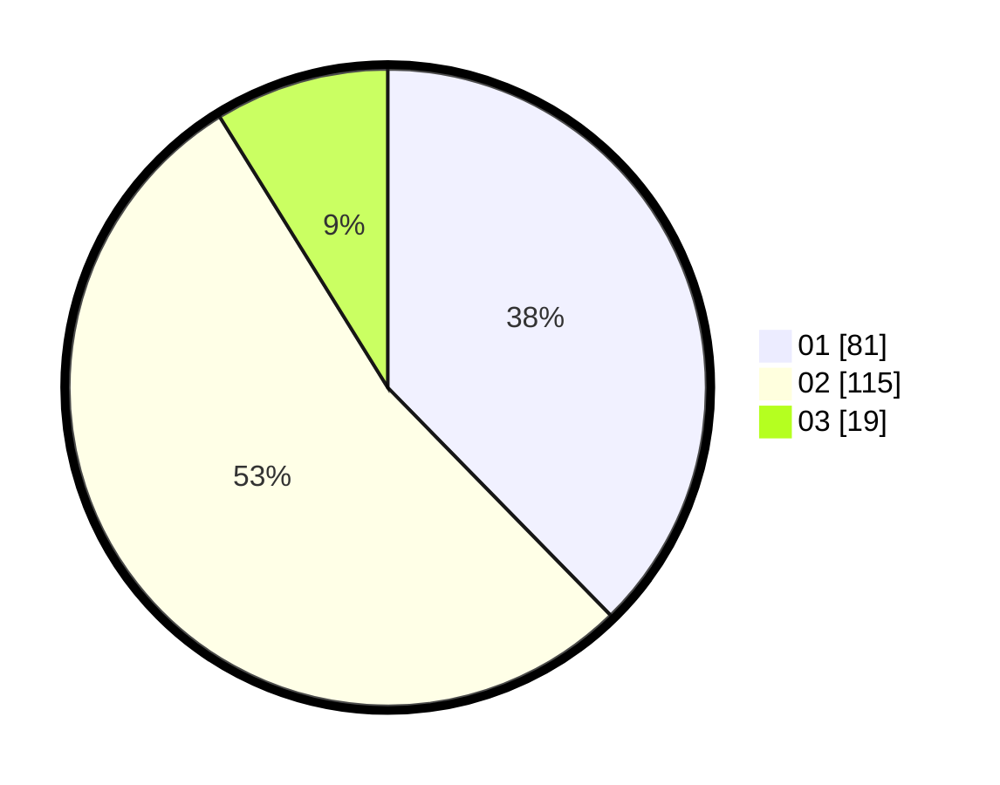

# Hasil

Hasil perolehan suara paslon dapat dilihat pada file paslon-01.txt, paslon-02.txt, dan paslon-03.txt.

Jika tidak ada, artinya data tersebut belum ada pada SIREKAP.

## Perolehan Suara

 * Paslon 01: **81**.
 * Paslon 02: **115**.
 * Paslon 03: **19**.

## Foto C Plano

https://sirekap-obj-formc.kpu.go.id/3607/pemilu/ppwp/31/73/06/10/01/3173061001036-20240215-142252--be4d9226-8b46-438b-bf41-2beae8585baa.jpg

https://sirekap-obj-formc.kpu.go.id/3607/pemilu/ppwp/31/73/06/10/01/3173061001036-20240215-142313--8b2dfb14-ed4d-4ce1-964a-ef70646790be.jpg

https://sirekap-obj-formc.kpu.go.id/3607/pemilu/ppwp/31/73/06/10/01/3173061001036-20240215-142303--bbeab4d1-0022-4648-8707-1bea5e56b6d8.jpg

## DATA PEMILIH TETAP

Jumlah pemilih dalam DPT: **270**.
 * L: **139**.
 * P: **131**.

## DATA PENGGUNA HAK PILIH

Jumlah pengguna hak pilih dalam DPT: **213**.
 * L: **104**.
 * P: **109**.

Jumlah pengguna hak pilih dalam DPTb: **1**.
 * L: **0**.
 * P: **1**.

Jumlah pengguna hak pilih dalam DPK: **2**.
 * L: **0**.
 * P: **2**.

Jumlah pengguna hak pilih: **216**.
 * L: **104**.
 * P: **112**.

## JUMLAH SUARA SAH DAN TIDAK SAH

JUMLAH SELURUH SUARA SAH: **215**.

JUMLAH SUARA TIDAK SAH: **1**.

JUMLAH SELURUH SUARA SAH DAN SUARA TIDAK SAH: **216**.
