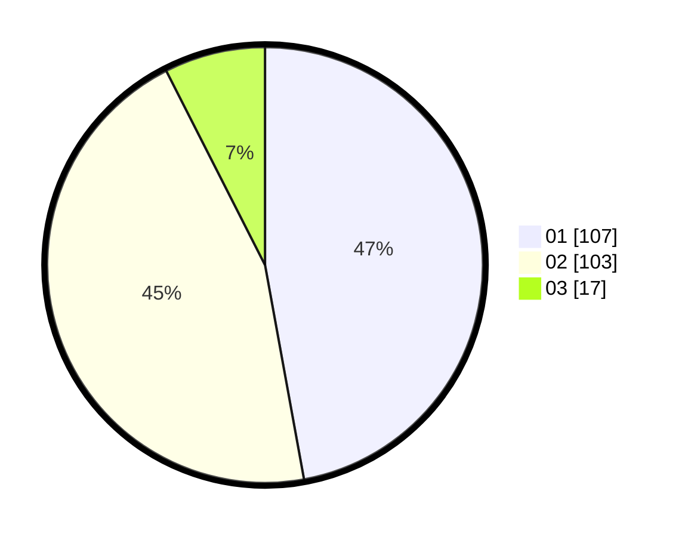

# Hasil

Hasil perolehan suara paslon dapat dilihat pada file paslon-01.txt, paslon-02.txt, dan paslon-03.txt.

Jika tidak ada, artinya data tersebut belum ada pada SIREKAP.

## Perolehan Suara

 * Paslon 01: **107**.
 * Paslon 02: **103**.
 * Paslon 03: **17**.

## Foto C Plano

https://sirekap-obj-formc.kpu.go.id/e7d2/pemilu/ppwp/31/73/06/10/01/3173061001040-20240214-220228--c981eeff-49d4-48af-b10f-060cbb6bdd15.jpg

https://sirekap-obj-formc.kpu.go.id/e7d2/pemilu/ppwp/31/73/06/10/01/3173061001040-20240214-220322--3f6a2f09-8440-4c53-b7d4-29fd693b9320.jpg

https://sirekap-obj-formc.kpu.go.id/e7d2/pemilu/ppwp/31/73/06/10/01/3173061001040-20240214-220412--05071cdb-ffcb-4998-ae9e-e0c76dbaf0e1.jpg

## DATA PEMILIH TETAP

Jumlah pemilih dalam DPT: **285**.
 * L: **148**.
 * P: **137**.

## DATA PENGGUNA HAK PILIH

Jumlah pengguna hak pilih dalam DPT: **229**.
 * L: **121**.
 * P: **108**.

Jumlah pengguna hak pilih dalam DPTb: **0**.
 * L: **0**.
 * P: **0**.

Jumlah pengguna hak pilih dalam DPK: **1**.
 * L: **1**.
 * P: **0**.

Jumlah pengguna hak pilih: **230**.
 * L: **122**.
 * P: **108**.

## JUMLAH SUARA SAH DAN TIDAK SAH

JUMLAH SELURUH SUARA SAH: **227**.

JUMLAH SUARA TIDAK SAH: **3**.

JUMLAH SELURUH SUARA SAH DAN SUARA TIDAK SAH: **230**.
