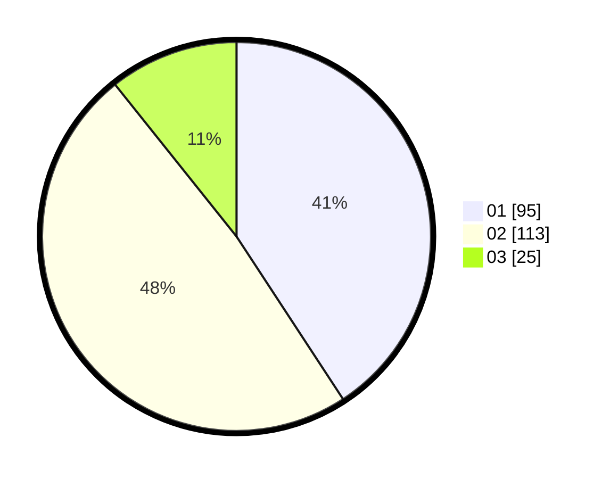

# Hasil

Hasil perolehan suara paslon dapat dilihat pada file paslon-01.txt, paslon-02.txt, dan paslon-03.txt.

Jika tidak ada, artinya data tersebut belum ada pada SIREKAP.

## Perolehan Suara

 * Paslon 01: **95**.
 * Paslon 02: **113**.
 * Paslon 03: **25**.

## Foto C Plano

https://sirekap-obj-formc.kpu.go.id/6e10/pemilu/ppwp/31/73/06/10/01/3173061001042-20240215-005610--71708234-52e1-474d-914b-fed68d61514c.jpg

https://sirekap-obj-formc.kpu.go.id/6e10/pemilu/ppwp/31/73/06/10/01/3173061001042-20240215-005731--188c9573-4114-444b-a7c6-d5450adc8655.jpg

https://sirekap-obj-formc.kpu.go.id/6e10/pemilu/ppwp/31/73/06/10/01/3173061001042-20240215-005814--698d128a-b2f5-4cf1-a64c-6e6ed6ff7cb3.jpg
