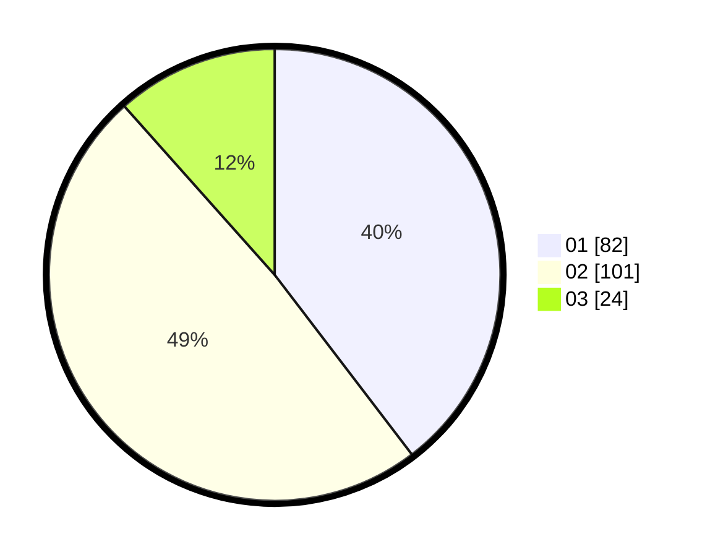

# Hasil

Hasil perolehan suara paslon dapat dilihat pada file paslon-01.txt, paslon-02.txt, dan paslon-03.txt.

Jika tidak ada, artinya data tersebut belum ada pada SIREKAP.

## Perolehan Suara

 * Paslon 01: **82**.
 * Paslon 02: **101**.
 * Paslon 03: **24**.

## Foto C Plano

https://sirekap-obj-formc.kpu.go.id/9855/pemilu/ppwp/31/73/06/10/01/3173061001048-20240214-190940--6f961cf5-2f0f-4955-a96b-edd11c1d11fa.jpg

https://sirekap-obj-formc.kpu.go.id/9855/pemilu/ppwp/31/73/06/10/01/3173061001048-20240214-191348--5339f468-d564-4e7e-8925-8298a27fddf9.jpg

https://sirekap-obj-formc.kpu.go.id/9855/pemilu/ppwp/31/73/06/10/01/3173061001048-20240214-190503--c1486d65-481c-43dc-ac8a-cfbf875866e2.jpg

## DATA PEMILIH TETAP

Jumlah pemilih dalam DPT: **285**.
 * L: **152**.
 * P: **133**.

## DATA PENGGUNA HAK PILIH

Jumlah pengguna hak pilih dalam DPT: **201**.
 * L: **102**.
 * P: **99**.

Jumlah pengguna hak pilih dalam DPTb: **8**.
 * L: **5**.
 * P: **3**.

Jumlah pengguna hak pilih dalam DPK: **0**.
 * L: **0**.
 * P: **0**.

Jumlah pengguna hak pilih: **209**.
 * L: **107**.
 * P: **102**.

## JUMLAH SUARA SAH DAN TIDAK SAH

JUMLAH SELURUH SUARA SAH: **207**.

JUMLAH SUARA TIDAK SAH: **2**.

JUMLAH SELURUH SUARA SAH DAN SUARA TIDAK SAH: **209**.
