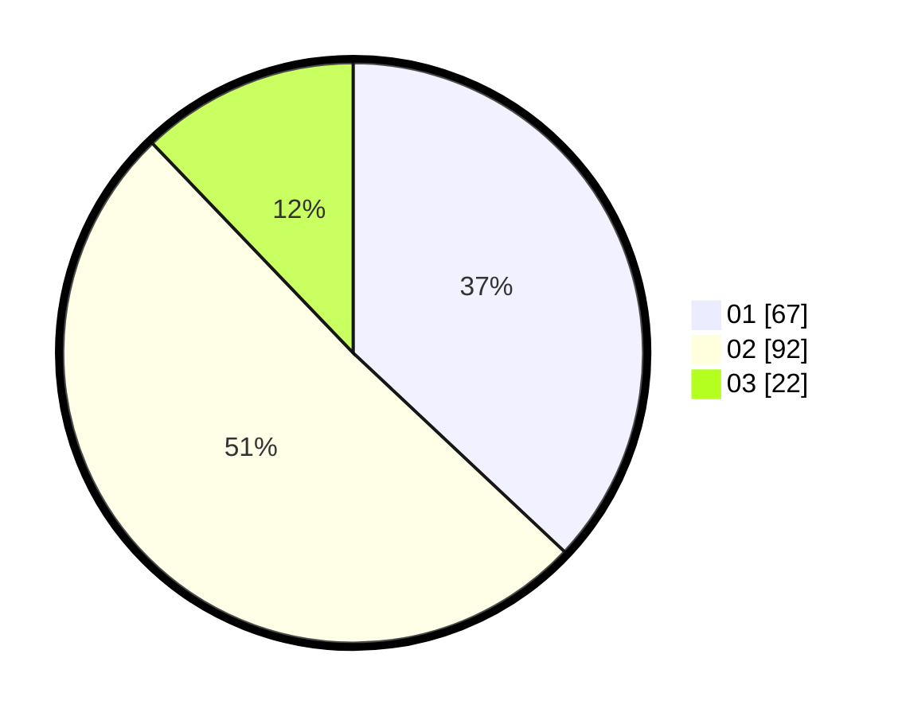

# Hasil

Hasil perolehan suara paslon dapat dilihat pada file paslon-01.txt, paslon-02.txt, dan paslon-03.txt.

Jika tidak ada, artinya data tersebut belum ada pada SIREKAP.

## Perolehan Suara

 * Paslon 01: **67**.
 * Paslon 02: **92**.
 * Paslon 03: **22**.

## Foto C Plano

https://sirekap-obj-formc.kpu.go.id/3fec/pemilu/ppwp/31/73/06/10/01/3173061001051-20240216-015321--efc220c2-3634-41f3-8f22-95b71ab456da.jpg

https://sirekap-obj-formc.kpu.go.id/3fec/pemilu/ppwp/31/73/06/10/01/3173061001051-20240214-194731--f4d579e8-faed-4758-9830-2ffaa7cde672.jpg

https://sirekap-obj-formc.kpu.go.id/3fec/pemilu/ppwp/31/73/06/10/01/3173061001051-20240214-194850--ccdc952c-0d1b-4f11-a525-2e00caf189ed.jpg

## DATA PEMILIH TETAP

Jumlah pemilih dalam DPT: **236**.
 * L: **129**.
 * P: **107**.

## DATA PENGGUNA HAK PILIH

Jumlah pengguna hak pilih dalam DPT: **180**.
 * L: **96**.
 * P: **84**.

Jumlah pengguna hak pilih dalam DPTb: **0**.
 * L: **0**.
 * P: **0**.

Jumlah pengguna hak pilih dalam DPK: **2**.
 * L: **0**.
 * P: **2**.

Jumlah pengguna hak pilih: **182**.
 * L: **96**.
 * P: **86**.

## JUMLAH SUARA SAH DAN TIDAK SAH

JUMLAH SELURUH SUARA SAH: **187**.

JUMLAH SUARA TIDAK SAH: **1**.

JUMLAH SELURUH SUARA SAH DAN SUARA TIDAK SAH: **182**.
