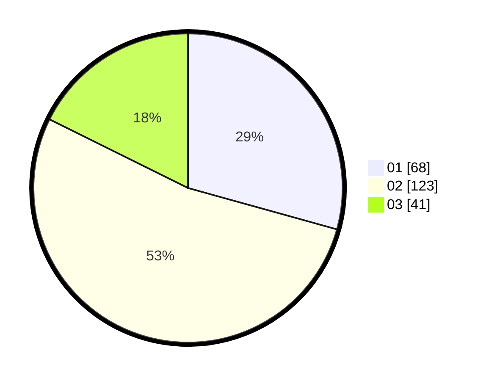

# Hasil

Hasil perolehan suara paslon dapat dilihat pada file paslon-01.txt, paslon-02.txt, dan paslon-03.txt.

Jika tidak ada, artinya data tersebut belum ada pada SIREKAP.

## Perolehan Suara

 * Paslon 01: **68**.
 * Paslon 02: **123**.
 * Paslon 03: **41**.

## Foto C Plano

https://sirekap-obj-formc.kpu.go.id/a8e0/pemilu/ppwp/31/73/06/10/01/3173061001053-20240216-134553--6b4c78cc-86e4-4cad-b1c0-83b5791e700d.jpg

https://sirekap-obj-formc.kpu.go.id/a8e0/pemilu/ppwp/31/73/06/10/01/3173061001053-20240214-221903--280732ea-e308-4842-93ee-99510d416f61.jpg

https://sirekap-obj-formc.kpu.go.id/a8e0/pemilu/ppwp/31/73/06/10/01/3173061001053-20240216-134553--72d6a431-9d4a-4c58-943a-5a28682c837e.jpg

## DATA PEMILIH TETAP

Jumlah pemilih dalam DPT: **296**.
 * L: **154**.
 * P: **142**.

## DATA PENGGUNA HAK PILIH

Jumlah pengguna hak pilih dalam DPT: **232**.
 * L: **115**.
 * P: **117**.

Jumlah pengguna hak pilih dalam DPTb: **1**.
 * L: **0**.
 * P: **1**.

Jumlah pengguna hak pilih dalam DPK: **1**.
 * L: **0**.
 * P: **1**.

Jumlah pengguna hak pilih: **234**.
 * L: **115**.
 * P: **119**.

## JUMLAH SUARA SAH DAN TIDAK SAH

JUMLAH SELURUH SUARA SAH: **232**.

JUMLAH SUARA TIDAK SAH: **2**.

JUMLAH SELURUH SUARA SAH DAN SUARA TIDAK SAH: **234**.
