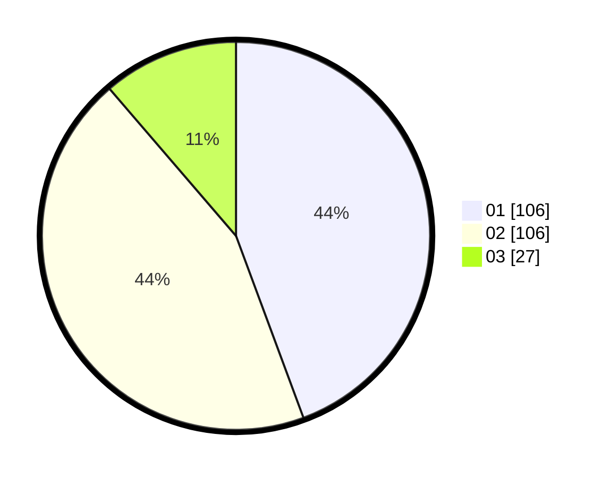

# Hasil

Hasil perolehan suara paslon dapat dilihat pada file paslon-01.txt, paslon-02.txt, dan paslon-03.txt.

Jika tidak ada, artinya data tersebut belum ada pada SIREKAP.

## Perolehan Suara

 * Paslon 01: **106**.
 * Paslon 02: **106**.
 * Paslon 03: **27**.

## Foto C Plano

https://sirekap-obj-formc.kpu.go.id/00f4/pemilu/ppwp/31/73/06/10/01/3173061001054-20240214-155516--39ce30bc-94d1-4900-8974-175f09a8c09d.jpg

https://sirekap-obj-formc.kpu.go.id/00f4/pemilu/ppwp/31/73/06/10/01/3173061001054-20240214-155257--fe2a88c1-dccc-4c78-a37d-57123a156c93.jpg

https://sirekap-obj-formc.kpu.go.id/00f4/pemilu/ppwp/31/73/06/10/01/3173061001054-20240215-203631--846a82a7-7ea2-4586-a6e4-b51d1a9996d3.jpg

## DATA PEMILIH TETAP

Jumlah pemilih dalam DPT: **297**.
 * L: **154**.
 * P: **143**.

## DATA PENGGUNA HAK PILIH

Jumlah pengguna hak pilih dalam DPT: **238**.
 * L: **118**.
 * P: **120**.

Jumlah pengguna hak pilih dalam DPTb: **0**.
 * L: **0**.
 * P: **0**.

Jumlah pengguna hak pilih dalam DPK: **4**.
 * L: **3**.
 * P: **1**.

Jumlah pengguna hak pilih: **242**.
 * L: **121**.
 * P: **121**.

## JUMLAH SUARA SAH DAN TIDAK SAH

JUMLAH SELURUH SUARA SAH: **239**.

JUMLAH SUARA TIDAK SAH: **3**.

JUMLAH SELURUH SUARA SAH DAN SUARA TIDAK SAH: **242**.
