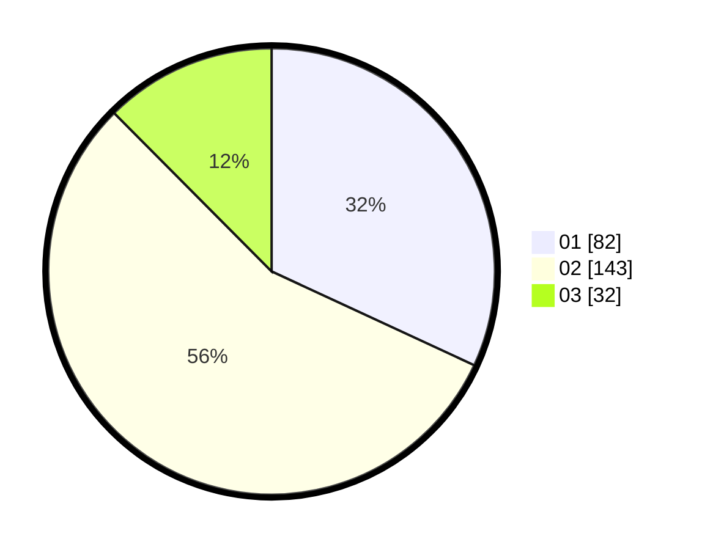

# Hasil

Hasil perolehan suara paslon dapat dilihat pada file paslon-01.txt, paslon-02.txt, dan paslon-03.txt.

Jika tidak ada, artinya data tersebut belum ada pada SIREKAP.

## Perolehan Suara

 * Paslon 01: **82**.
 * Paslon 02: **143**.
 * Paslon 03: **32**.

## Foto C Plano

https://sirekap-obj-formc.kpu.go.id/b5a7/pemilu/ppwp/31/73/06/10/01/3173061001055-20240214-185826--50202f9e-7f2e-4ec8-a87c-9a581c9db61d.jpg

https://sirekap-obj-formc.kpu.go.id/b5a7/pemilu/ppwp/31/73/06/10/01/3173061001055-20240214-190718--101f6a12-d8ed-44b9-baac-cc4b55b80bac.jpg

https://sirekap-obj-formc.kpu.go.id/b5a7/pemilu/ppwp/31/73/06/10/01/3173061001055-20240214-190602--1660c077-282b-443c-a0e2-87e844613c0a.jpg

## DATA PEMILIH TETAP

Jumlah pemilih dalam DPT: **299**.
 * L: **157**.
 * P: **142**.

## DATA PENGGUNA HAK PILIH

Jumlah pengguna hak pilih dalam DPT: **258**.
 * L: **134**.
 * P: **124**.

Jumlah pengguna hak pilih dalam DPTb: **0**.
 * L: **0**.
 * P: **0**.

Jumlah pengguna hak pilih dalam DPK: **0**.
 * L: **0**.
 * P: **0**.

Jumlah pengguna hak pilih: **258**.
 * L: **134**.
 * P: **124**.

## JUMLAH SUARA SAH DAN TIDAK SAH

JUMLAH SELURUH SUARA SAH: **257**.

JUMLAH SUARA TIDAK SAH: **1**.

JUMLAH SELURUH SUARA SAH DAN SUARA TIDAK SAH: **258**.
