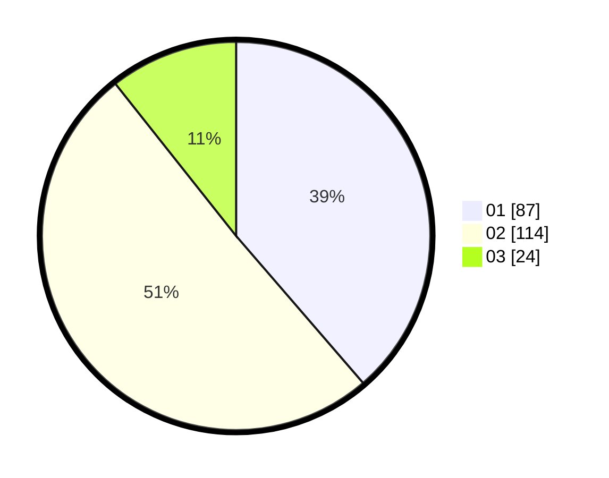

# Hasil

Hasil perolehan suara paslon dapat dilihat pada file paslon-01.txt, paslon-02.txt, dan paslon-03.txt.

Jika tidak ada, artinya data tersebut belum ada pada SIREKAP.

## Perolehan Suara

 * Paslon 01: **87**.
 * Paslon 02: **114**.
 * Paslon 03: **24**.

## Foto C Plano

https://sirekap-obj-formc.kpu.go.id/a480/pemilu/ppwp/31/73/06/10/01/3173061001056-20240215-204519--215c9789-e5e9-4fb9-b1e2-8096467d8353.jpg

https://sirekap-obj-formc.kpu.go.id/a480/pemilu/ppwp/31/73/06/10/01/3173061001056-20240214-190827--c1feaa44-e99d-47b7-bd2b-ebc8c4e7e620.jpg

https://sirekap-obj-formc.kpu.go.id/a480/pemilu/ppwp/31/73/06/10/01/3173061001056-20240215-204520--e736bed5-85b2-405e-be72-9b0a53762fc2.jpg

## DATA PEMILIH TETAP

Jumlah pemilih dalam DPT: **299**.
 * L: **161**.
 * P: **138**.

## DATA PENGGUNA HAK PILIH

Jumlah pengguna hak pilih dalam DPT: **228**.
 * L: **118**.
 * P: **110**.

Jumlah pengguna hak pilih dalam DPTb: **0**.
 * L: **0**.
 * P: **0**.

Jumlah pengguna hak pilih dalam DPK: **1**.
 * L: **0**.
 * P: **1**.

Jumlah pengguna hak pilih: **229**.
 * L: **118**.
 * P: **111**.

## JUMLAH SUARA SAH DAN TIDAK SAH

JUMLAH SELURUH SUARA SAH: **225**.

JUMLAH SUARA TIDAK SAH: **4**.

JUMLAH SELURUH SUARA SAH DAN SUARA TIDAK SAH: **229**.
