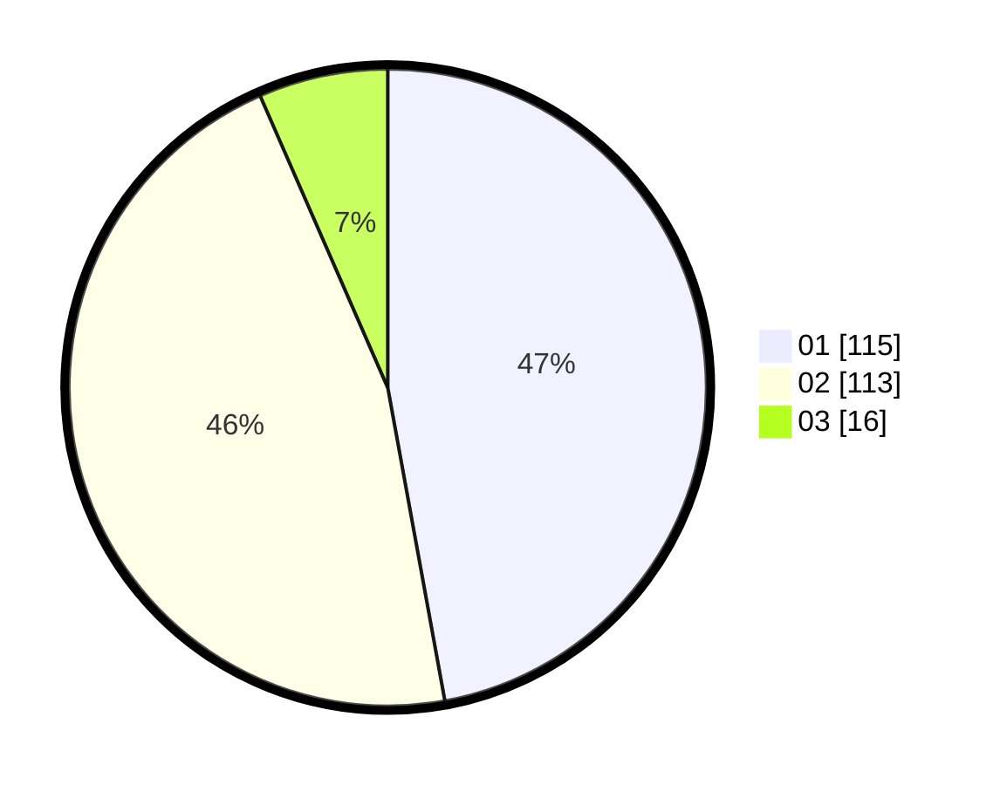

# Hasil

Hasil perolehan suara paslon dapat dilihat pada file paslon-01.txt, paslon-02.txt, dan paslon-03.txt.

Jika tidak ada, artinya data tersebut belum ada pada SIREKAP.

## Perolehan Suara

 * Paslon 01: **115**.
 * Paslon 02: **113**.
 * Paslon 03: **16**.

## Foto C Plano

https://sirekap-obj-formc.kpu.go.id/df58/pemilu/ppwp/31/73/06/10/01/3173061001057-20240216-035428--6a64f5fd-a688-450c-9ef6-7f2732ee977d.jpg

https://sirekap-obj-formc.kpu.go.id/df58/pemilu/ppwp/31/73/06/10/01/3173061001057-20240216-035433--1613a433-4e94-4156-83d6-3185cb838dfe.jpg

https://sirekap-obj-formc.kpu.go.id/df58/pemilu/ppwp/31/73/06/10/01/3173061001057-20240216-035429--e0a136e0-c795-4d61-b7bd-5318c325d666.jpg

## DATA PEMILIH TETAP

Jumlah pemilih dalam DPT: **299**.
 * L: **148**.
 * P: **151**.

## DATA PENGGUNA HAK PILIH

Jumlah pengguna hak pilih dalam DPT: **242**.
 * L: **116**.
 * P: **126**.

Jumlah pengguna hak pilih dalam DPTb: **1**.
 * L: **1**.
 * P: **0**.

Jumlah pengguna hak pilih dalam DPK: **1**.
 * L: **1**.
 * P: **0**.

Jumlah pengguna hak pilih: **244**.
 * L: **118**.
 * P: **126**.

## JUMLAH SUARA SAH DAN TIDAK SAH

JUMLAH SELURUH SUARA SAH: **244**.

JUMLAH SUARA TIDAK SAH: **0**.

JUMLAH SELURUH SUARA SAH DAN SUARA TIDAK SAH: **244**.
