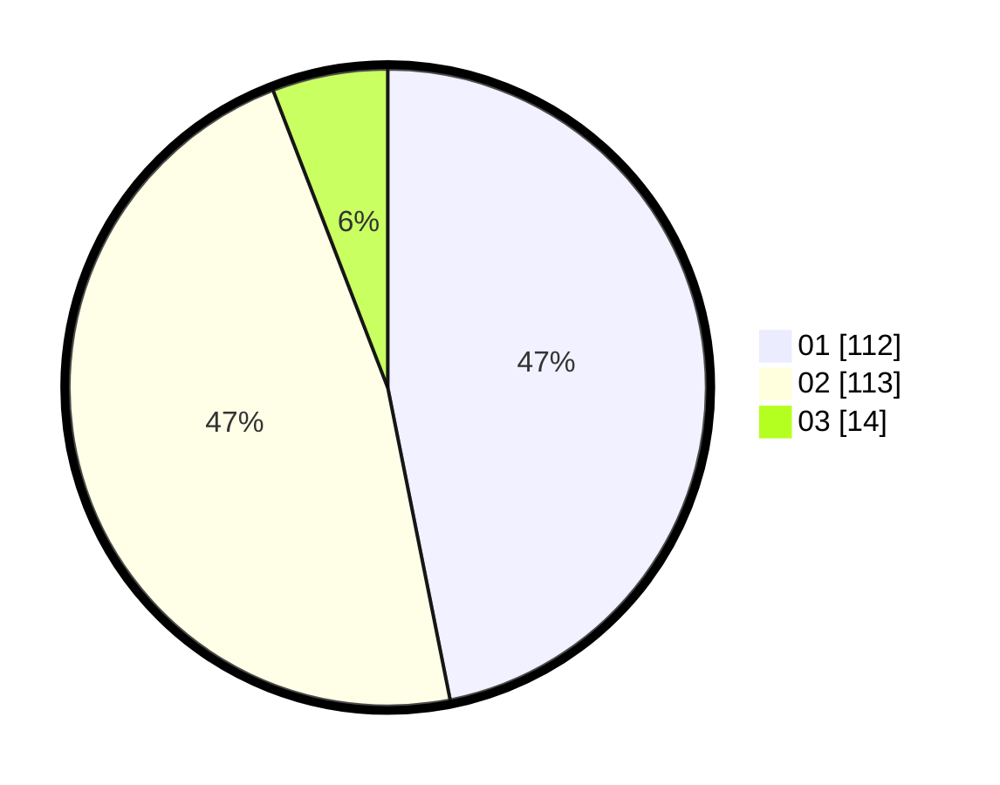

# Hasil

Hasil perolehan suara paslon dapat dilihat pada file paslon-01.txt, paslon-02.txt, dan paslon-03.txt.

Jika tidak ada, artinya data tersebut belum ada pada SIREKAP.

## Perolehan Suara

 * Paslon 01: **112**.
 * Paslon 02: **113**.
 * Paslon 03: **14**.

## Foto C Plano

https://sirekap-obj-formc.kpu.go.id/c3aa/pemilu/ppwp/31/73/06/10/01/3173061001062-20240214-215328--3a10a8cc-a46c-4723-83d1-23fa449159b4.jpg

https://sirekap-obj-formc.kpu.go.id/c3aa/pemilu/ppwp/31/73/06/10/01/3173061001062-20240214-215428--66e57a90-11c7-4e06-b7b1-d37e036ddb21.jpg

https://sirekap-obj-formc.kpu.go.id/c3aa/pemilu/ppwp/31/73/06/10/01/3173061001062-20240214-215518--39abee44-b506-4bfe-819a-f5504ba4f44a.jpg
