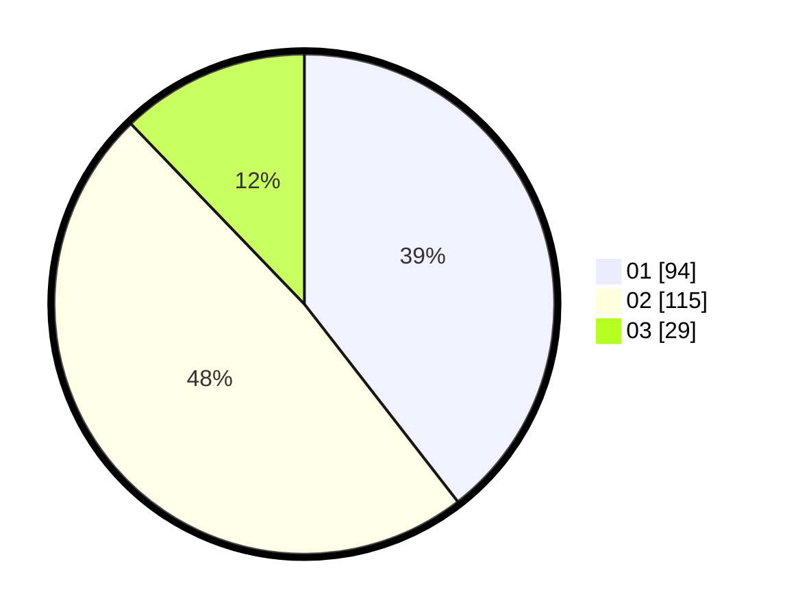

# Hasil

Hasil perolehan suara paslon dapat dilihat pada file paslon-01.txt, paslon-02.txt, dan paslon-03.txt.

Jika tidak ada, artinya data tersebut belum ada pada SIREKAP.

## Perolehan Suara

 * Paslon 01: **94**.
 * Paslon 02: **115**.
 * Paslon 03: **29**.

## Foto C Plano

https://sirekap-obj-formc.kpu.go.id/7b5b/pemilu/ppwp/31/73/06/10/01/3173061001069-20240216-081158--6158cce0-582f-42db-8e9a-dae444be585f.jpg

https://sirekap-obj-formc.kpu.go.id/7b5b/pemilu/ppwp/31/73/06/10/01/3173061001069-20240216-071614--cf2f2886-a634-47c7-a24f-22850506c826.jpg

https://sirekap-obj-formc.kpu.go.id/7b5b/pemilu/ppwp/31/73/06/10/01/3173061001069-20240216-081159--e769e18c-aad8-436c-9b98-452186d3aa20.jpg

## DATA PEMILIH TETAP

Jumlah pemilih dalam DPT: **296**.
 * L: **140**.
 * P: **156**.

## DATA PENGGUNA HAK PILIH

Jumlah pengguna hak pilih dalam DPT: **239**.
 * L: **112**.
 * P: **127**.

Jumlah pengguna hak pilih dalam DPTb: **0**.
 * L: **1**.
 * P: **0**.

Jumlah pengguna hak pilih dalam DPK: **0**.
 * L: **0**.
 * P: **0**.

Jumlah pengguna hak pilih: **240**.
 * L: **113**.
 * P: **127**.

## JUMLAH SUARA SAH DAN TIDAK SAH

JUMLAH SELURUH SUARA SAH: **238**.

JUMLAH SUARA TIDAK SAH: **2**.

JUMLAH SELURUH SUARA SAH DAN SUARA TIDAK SAH: **240**.
