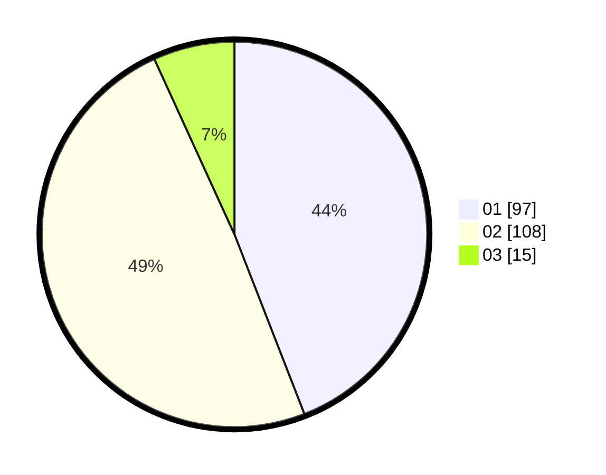

# Hasil

Hasil perolehan suara paslon dapat dilihat pada file paslon-01.txt, paslon-02.txt, dan paslon-03.txt.

Jika tidak ada, artinya data tersebut belum ada pada SIREKAP.

## Perolehan Suara

 * Paslon 01: **97**.
 * Paslon 02: **108**.
 * Paslon 03: **15**.

## Foto C Plano

https://sirekap-obj-formc.kpu.go.id/33ba/pemilu/ppwp/31/73/06/10/01/3173061001070-20240214-141514--59d20b01-04e2-4cef-9941-14a47faef23b.jpg

https://sirekap-obj-formc.kpu.go.id/33ba/pemilu/ppwp/31/73/06/10/01/3173061001070-20240214-141650--68073edc-1c19-4ead-8e68-ac21b657fbd3.jpg

https://sirekap-obj-formc.kpu.go.id/33ba/pemilu/ppwp/31/73/06/10/01/3173061001070-20240214-141552--2659a7f2-3395-439c-afed-fd6d5c7b9526.jpg

## DATA PEMILIH TETAP

Jumlah pemilih dalam DPT: **280**.
 * L: **147**.
 * P: **133**.

## DATA PENGGUNA HAK PILIH

Jumlah pengguna hak pilih dalam DPT: **223**.
 * L: **116**.
 * P: **107**.

Jumlah pengguna hak pilih dalam DPTb: **0**.
 * L: **0**.
 * P: **0**.

Jumlah pengguna hak pilih dalam DPK: **0**.
 * L: **0**.
 * P: **0**.

Jumlah pengguna hak pilih: **223**.
 * L: **116**.
 * P: **107**.

## JUMLAH SUARA SAH DAN TIDAK SAH

JUMLAH SELURUH SUARA SAH: **220**.

JUMLAH SUARA TIDAK SAH: **3**.

JUMLAH SELURUH SUARA SAH DAN SUARA TIDAK SAH: **223**.
