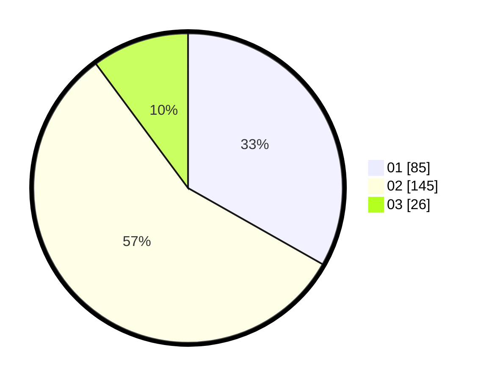

# Hasil

Hasil perolehan suara paslon dapat dilihat pada file paslon-01.txt, paslon-02.txt, dan paslon-03.txt.

Jika tidak ada, artinya data tersebut belum ada pada SIREKAP.

## Perolehan Suara

 * Paslon 01: **85**.
 * Paslon 02: **145**.
 * Paslon 03: **26**.

## Foto C Plano

https://sirekap-obj-formc.kpu.go.id/6017/pemilu/ppwp/31/73/06/10/01/3173061001071-20240214-185914--a16b3e97-f91e-42df-9563-25307e02da32.jpg

https://sirekap-obj-formc.kpu.go.id/6017/pemilu/ppwp/31/73/06/10/01/3173061001071-20240214-191501--ac8e869a-2ddb-405f-95b9-ea3b1fba9ac0.jpg

https://sirekap-obj-formc.kpu.go.id/6017/pemilu/ppwp/31/73/06/10/01/3173061001071-20240214-190038--998c9c10-34cf-4ce7-86af-9b6f5014c74a.jpg

## DATA PEMILIH TETAP

Jumlah pemilih dalam DPT: **275**.
 * L: **142**.
 * P: **133**.

## DATA PENGGUNA HAK PILIH

Jumlah pengguna hak pilih dalam DPT: **228**.
 * L: **112**.
 * P: **116**.

Jumlah pengguna hak pilih dalam DPTb: **3**.
 * L: **1**.
 * P: **2**.

Jumlah pengguna hak pilih dalam DPK: **28**.
 * L: **17**.
 * P: **11**.

Jumlah pengguna hak pilih: **259**.
 * L: **130**.
 * P: **129**.

## JUMLAH SUARA SAH DAN TIDAK SAH

JUMLAH SELURUH SUARA SAH: **256**.

JUMLAH SUARA TIDAK SAH: **3**.

JUMLAH SELURUH SUARA SAH DAN SUARA TIDAK SAH: **259**.
