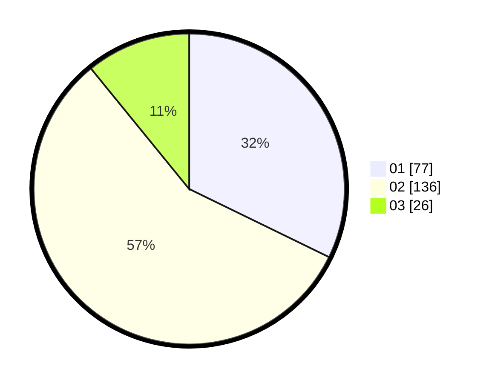

# Hasil

Hasil perolehan suara paslon dapat dilihat pada file paslon-01.txt, paslon-02.txt, dan paslon-03.txt.

Jika tidak ada, artinya data tersebut belum ada pada SIREKAP.

## Perolehan Suara

 * Paslon 01: **77**.
 * Paslon 02: **136**.
 * Paslon 03: **26**.

## Foto C Plano

https://sirekap-obj-formc.kpu.go.id/bb15/pemilu/ppwp/31/73/06/10/01/3173061001072-20240214-205905--56e09b78-5f39-4e68-9b6f-3e96e1f89f97.jpg

https://sirekap-obj-formc.kpu.go.id/bb15/pemilu/ppwp/31/73/06/10/01/3173061001072-20240214-210205--3f2ff829-b80d-4c0b-a348-cd62dede90cb.jpg

https://sirekap-obj-formc.kpu.go.id/bb15/pemilu/ppwp/31/73/06/10/01/3173061001072-20240214-210522--f9c4209c-735d-4d38-ac59-8a1eafb366a3.jpg
