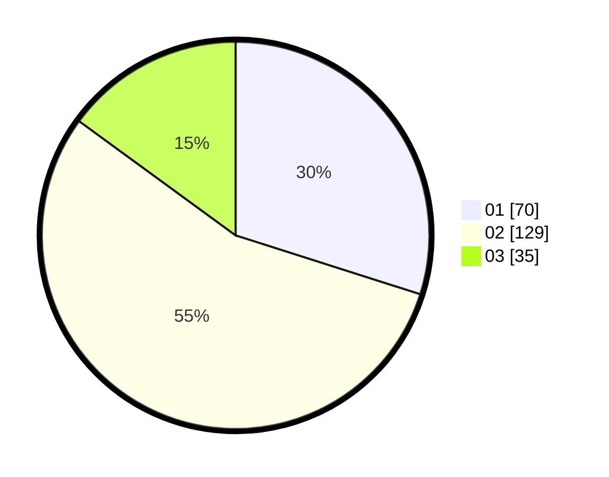

# Hasil

Hasil perolehan suara paslon dapat dilihat pada file paslon-01.txt, paslon-02.txt, dan paslon-03.txt.

Jika tidak ada, artinya data tersebut belum ada pada SIREKAP.

## Perolehan Suara

 * Paslon 01: **70**.
 * Paslon 02: **129**.
 * Paslon 03: **35**.

## Foto C Plano

https://sirekap-obj-formc.kpu.go.id/224b/pemilu/ppwp/31/73/06/10/01/3173061001074-20240216-051059--a5fce064-fa6c-4326-b3a9-4b597fc509de.jpg

https://sirekap-obj-formc.kpu.go.id/224b/pemilu/ppwp/31/73/06/10/01/3173061001074-20240216-051108--b3db513e-ada0-4275-b627-8a00c96fa9bb.jpg

https://sirekap-obj-formc.kpu.go.id/224b/pemilu/ppwp/31/73/06/10/01/3173061001074-20240216-051106--da9f100c-29e6-442d-b626-304e63082585.jpg

## DATA PEMILIH TETAP

Jumlah pemilih dalam DPT: **297**.
 * L: **135**.
 * P: **162**.

## DATA PENGGUNA HAK PILIH

Jumlah pengguna hak pilih dalam DPT: **235**.
 * L: **116**.
 * P: **119**.

Jumlah pengguna hak pilih dalam DPTb: **1**.
 * L: **1**.
 * P: **0**.

Jumlah pengguna hak pilih dalam DPK: **0**.
 * L: **0**.
 * P: **0**.

Jumlah pengguna hak pilih: **236**.
 * L: **116**.
 * P: **119**.

## JUMLAH SUARA SAH DAN TIDAK SAH

JUMLAH SELURUH SUARA SAH: **234**.

JUMLAH SUARA TIDAK SAH: **2**.

JUMLAH SELURUH SUARA SAH DAN SUARA TIDAK SAH: **236**.
