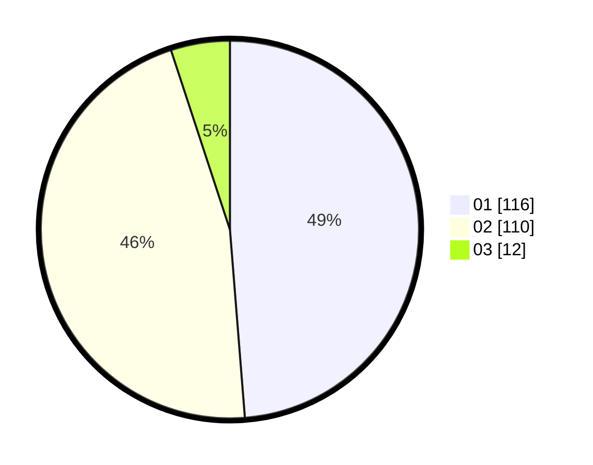

# Hasil

Hasil perolehan suara paslon dapat dilihat pada file paslon-01.txt, paslon-02.txt, dan paslon-03.txt.

Jika tidak ada, artinya data tersebut belum ada pada SIREKAP.

## Perolehan Suara

 * Paslon 01: **116**.
 * Paslon 02: **110**.
 * Paslon 03: **12**.

## Foto C Plano

https://sirekap-obj-formc.kpu.go.id/2452/pemilu/ppwp/31/73/06/10/01/3173061001078-20240214-155636--0cf4d943-4501-4f1b-8022-fd9d4e9cc3c1.jpg

https://sirekap-obj-formc.kpu.go.id/2452/pemilu/ppwp/31/73/06/10/01/3173061001078-20240214-155747--47de19bd-445a-4ed1-b19d-602372db0c00.jpg

https://sirekap-obj-formc.kpu.go.id/2452/pemilu/ppwp/31/73/06/10/01/3173061001078-20240214-155848--21a13889-024e-4ef8-b159-e8055aead704.jpg

## DATA PEMILIH TETAP

Jumlah pemilih dalam DPT: **284**.
 * L: **143**.
 * P: **141**.

## DATA PENGGUNA HAK PILIH

Jumlah pengguna hak pilih dalam DPT: **234**.
 * L: **118**.
 * P: **116**.

Jumlah pengguna hak pilih dalam DPTb: **1**.
 * L: **1**.
 * P: **0**.

Jumlah pengguna hak pilih dalam DPK: **4**.
 * L: **0**.
 * P: **4**.

Jumlah pengguna hak pilih: **239**.
 * L: **119**.
 * P: **120**.

## JUMLAH SUARA SAH DAN TIDAK SAH

JUMLAH SELURUH SUARA SAH: **238**.

JUMLAH SUARA TIDAK SAH: **1**.

JUMLAH SELURUH SUARA SAH DAN SUARA TIDAK SAH: **239**.
