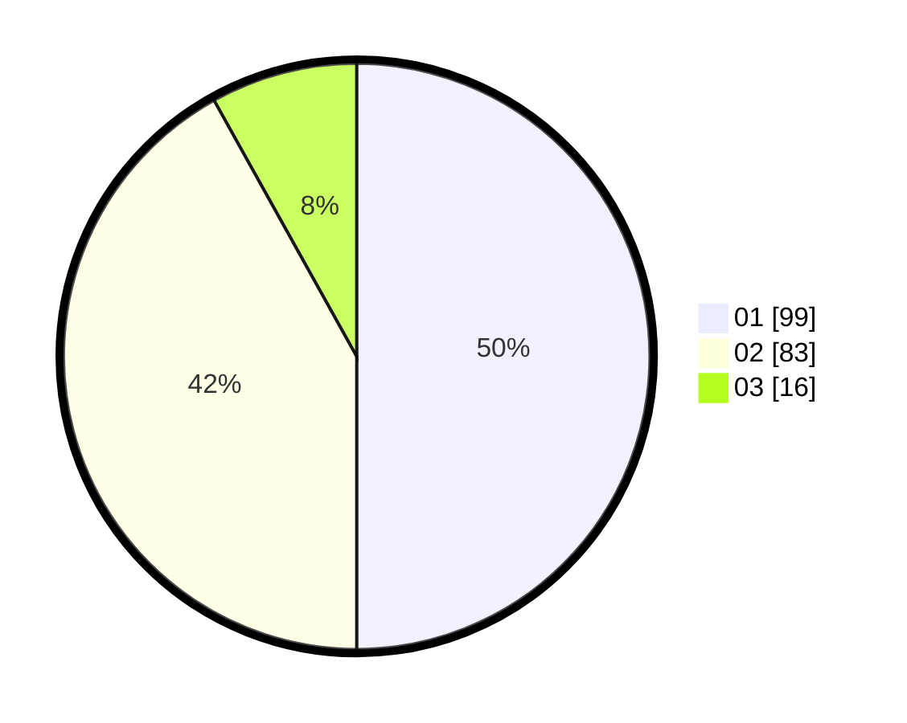

# Hasil

Hasil perolehan suara paslon dapat dilihat pada file paslon-01.txt, paslon-02.txt, dan paslon-03.txt.

Jika tidak ada, artinya data tersebut belum ada pada SIREKAP.

## Perolehan Suara

 * Paslon 01: **99**.
 * Paslon 02: **83**.
 * Paslon 03: **16**.

## Foto C Plano

https://sirekap-obj-formc.kpu.go.id/742c/pemilu/ppwp/31/73/06/10/01/3173061001081-20240214-201650--449e9e52-515d-4747-ba45-35ce09a9c553.jpg

https://sirekap-obj-formc.kpu.go.id/742c/pemilu/ppwp/31/73/06/10/01/3173061001081-20240214-202234--a6cc7edb-e608-416d-a3d7-a15ff49741aa.jpg

https://sirekap-obj-formc.kpu.go.id/742c/pemilu/ppwp/31/73/06/10/01/3173061001081-20240214-200304--c4ce595b-b7e4-4c84-8006-d216bc23107e.jpg

## DATA PEMILIH TETAP

Jumlah pemilih dalam DPT: **248**.
 * L: **131**.
 * P: **117**.

## DATA PENGGUNA HAK PILIH

Jumlah pengguna hak pilih dalam DPT: **199**.
 * L: **101**.
 * P: **98**.

Jumlah pengguna hak pilih dalam DPTb: **2**.
 * L: **2**.
 * P: **0**.

Jumlah pengguna hak pilih dalam DPK: **0**.
 * L: **0**.
 * P: **0**.

Jumlah pengguna hak pilih: **201**.
 * L: **103**.
 * P: **98**.

## JUMLAH SUARA SAH DAN TIDAK SAH

JUMLAH SELURUH SUARA SAH: **198**.

JUMLAH SUARA TIDAK SAH: **1**.

JUMLAH SELURUH SUARA SAH DAN SUARA TIDAK SAH: **199**.
