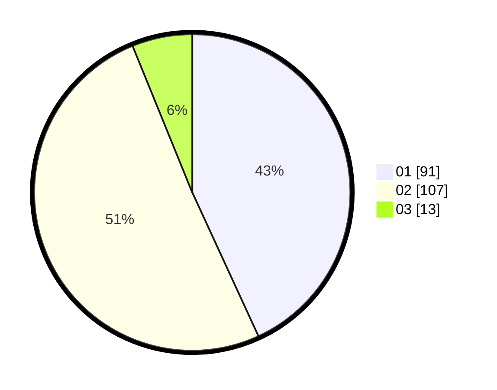

# Hasil

Hasil perolehan suara paslon dapat dilihat pada file paslon-01.txt, paslon-02.txt, dan paslon-03.txt.

Jika tidak ada, artinya data tersebut belum ada pada SIREKAP.

## Perolehan Suara

 * Paslon 01: **91**.
 * Paslon 02: **107**.
 * Paslon 03: **13**.

## Foto C Plano

https://sirekap-obj-formc.kpu.go.id/6aea/pemilu/ppwp/31/73/06/10/01/3173061001083-20240214-200547--aff1b33e-0a00-4faf-bc52-09fdd06d68f1.jpg

https://sirekap-obj-formc.kpu.go.id/6aea/pemilu/ppwp/31/73/06/10/01/3173061001083-20240214-200644--2f5198a7-61d7-4dd3-9c54-9c74b353022e.jpg

https://sirekap-obj-formc.kpu.go.id/6aea/pemilu/ppwp/31/73/06/10/01/3173061001083-20240214-200724--34e059ea-d298-4abf-9d64-5f30c77bc6b6.jpg
