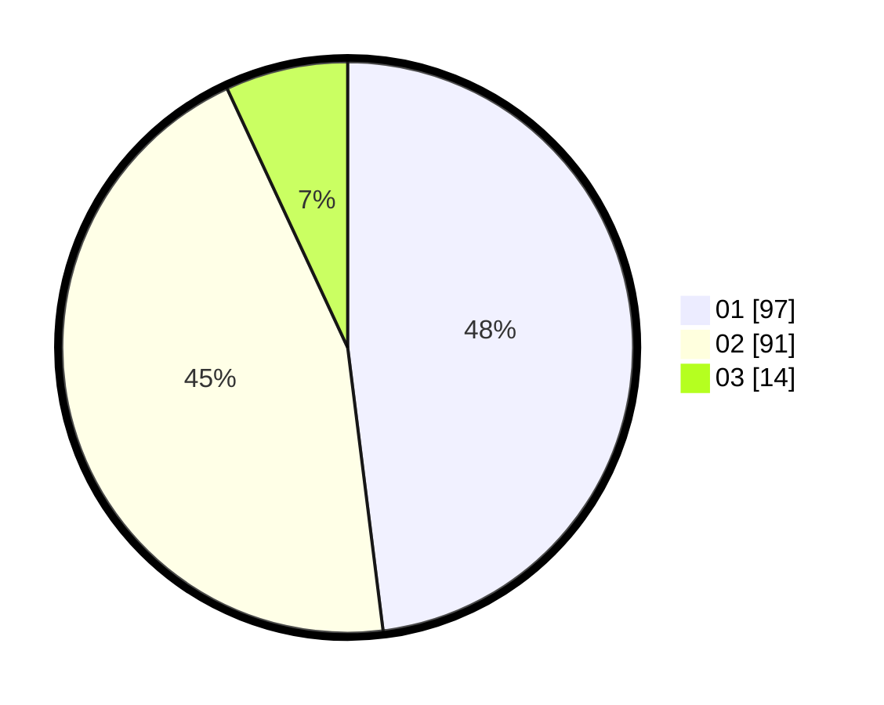

# Hasil

Hasil perolehan suara paslon dapat dilihat pada file paslon-01.txt, paslon-02.txt, dan paslon-03.txt.

Jika tidak ada, artinya data tersebut belum ada pada SIREKAP.

## Perolehan Suara

 * Paslon 01: **97**.
 * Paslon 02: **91**.
 * Paslon 03: **14**.

## Foto C Plano

https://sirekap-obj-formc.kpu.go.id/3dd7/pemilu/ppwp/31/73/06/10/01/3173061001084-20240216-190445--c9152fd6-2b14-4099-b6d6-b3c460d0ec0a.jpg

https://sirekap-obj-formc.kpu.go.id/3dd7/pemilu/ppwp/31/73/06/10/01/3173061001084-20240216-190447--f33fa2fb-f651-4bfe-b641-a115fc9d1ec9.jpg

https://sirekap-obj-formc.kpu.go.id/3dd7/pemilu/ppwp/31/73/06/10/01/3173061001084-20240216-190446--cc3f0e27-8379-4e55-82e1-79cb3387a8f1.jpg

## DATA PEMILIH TETAP

Jumlah pemilih dalam DPT: **255**.
 * L: **127**.
 * P: **128**.

## DATA PENGGUNA HAK PILIH

Jumlah pengguna hak pilih dalam DPT: **205**.
 * L: **102**.
 * P: **103**.

Jumlah pengguna hak pilih dalam DPTb: **0**.
 * L: **0**.
 * P: **0**.

Jumlah pengguna hak pilih dalam DPK: **0**.
 * L: **0**.
 * P: **0**.

Jumlah pengguna hak pilih: **205**.
 * L: **102**.
 * P: **103**.

## JUMLAH SUARA SAH DAN TIDAK SAH

JUMLAH SELURUH SUARA SAH: **202**.

JUMLAH SUARA TIDAK SAH: **3**.

JUMLAH SELURUH SUARA SAH DAN SUARA TIDAK SAH: **205**.
