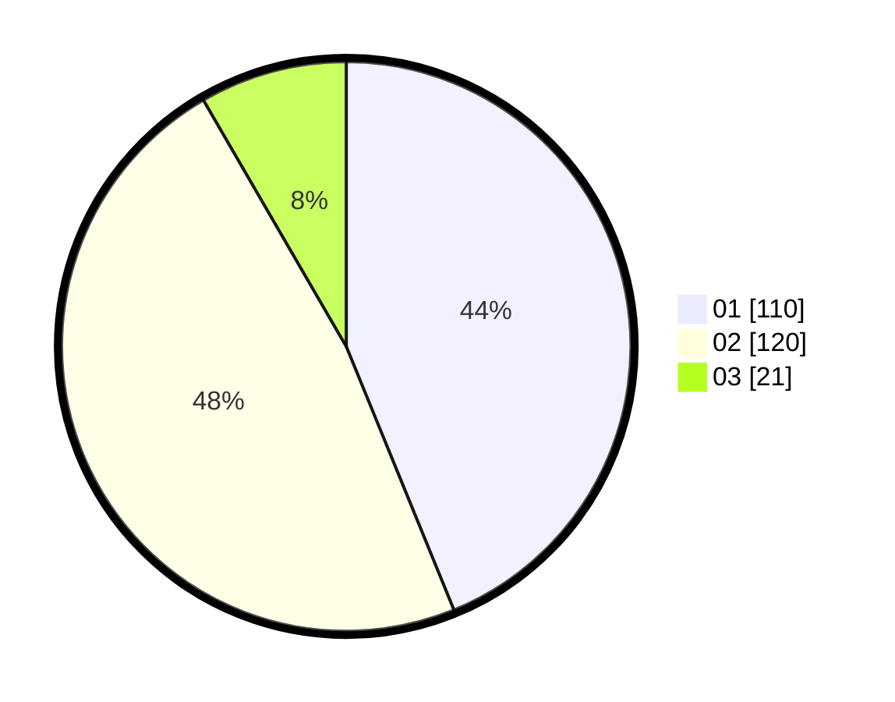

# Hasil

Hasil perolehan suara paslon dapat dilihat pada file paslon-01.txt, paslon-02.txt, dan paslon-03.txt.

Jika tidak ada, artinya data tersebut belum ada pada SIREKAP.

## Perolehan Suara

 * Paslon 01: **110**.
 * Paslon 02: **120**.
 * Paslon 03: **21**.

## Foto C Plano

https://sirekap-obj-formc.kpu.go.id/4516/pemilu/ppwp/31/73/06/10/01/3173061001088-20240214-212755--b53b4176-610a-4d65-9d28-d909fb1541af.jpg

https://sirekap-obj-formc.kpu.go.id/4516/pemilu/ppwp/31/73/06/10/01/3173061001088-20240214-212842--72f56123-586f-47fe-98f6-8634dca350b8.jpg
