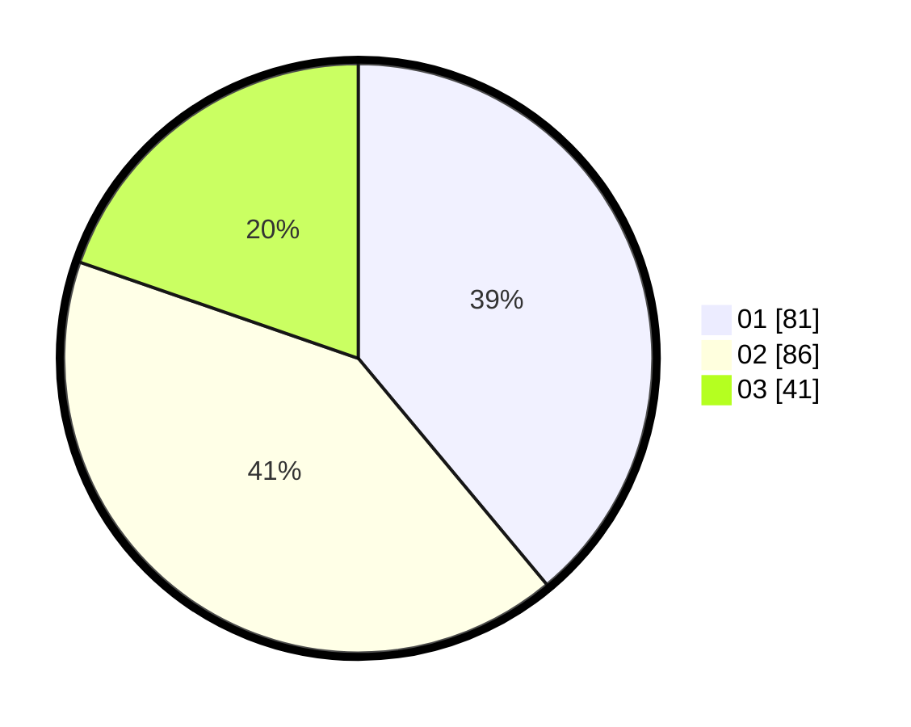

# Hasil

Hasil perolehan suara paslon dapat dilihat pada file paslon-01.txt, paslon-02.txt, dan paslon-03.txt.

Jika tidak ada, artinya data tersebut belum ada pada SIREKAP.

## Perolehan Suara

 * Paslon 01: **81**.
 * Paslon 02: **86**.
 * Paslon 03: **41**.

## Foto C Plano

https://sirekap-obj-formc.kpu.go.id/bdcc/pemilu/ppwp/31/73/06/10/01/3173061001094-20240216-023303--4a7d4018-c086-4e2c-94bb-06fe2e79a00d.jpg

https://sirekap-obj-formc.kpu.go.id/bdcc/pemilu/ppwp/31/73/06/10/01/3173061001094-20240216-023304--0b955634-1b07-4ea2-9312-90298dfb844b.jpg

https://sirekap-obj-formc.kpu.go.id/bdcc/pemilu/ppwp/31/73/06/10/01/3173061001094-20240216-023303--68884227-e829-4d6f-88ae-173a6216d538.jpg

## DATA PEMILIH TETAP

Jumlah pemilih dalam DPT: **268**.
 * L: **141**.
 * P: **127**.

## DATA PENGGUNA HAK PILIH

Jumlah pengguna hak pilih dalam DPT: **201**.
 * L: **104**.
 * P: **97**.

Jumlah pengguna hak pilih dalam DPTb: **0**.
 * L: **0**.
 * P: **0**.

Jumlah pengguna hak pilih dalam DPK: **9**.
 * L: **4**.
 * P: **5**.

Jumlah pengguna hak pilih: **210**.
 * L: **108**.
 * P: **102**.

## JUMLAH SUARA SAH DAN TIDAK SAH

JUMLAH SELURUH SUARA SAH: **208**.

JUMLAH SUARA TIDAK SAH: **2**.

JUMLAH SELURUH SUARA SAH DAN SUARA TIDAK SAH: **210**.
