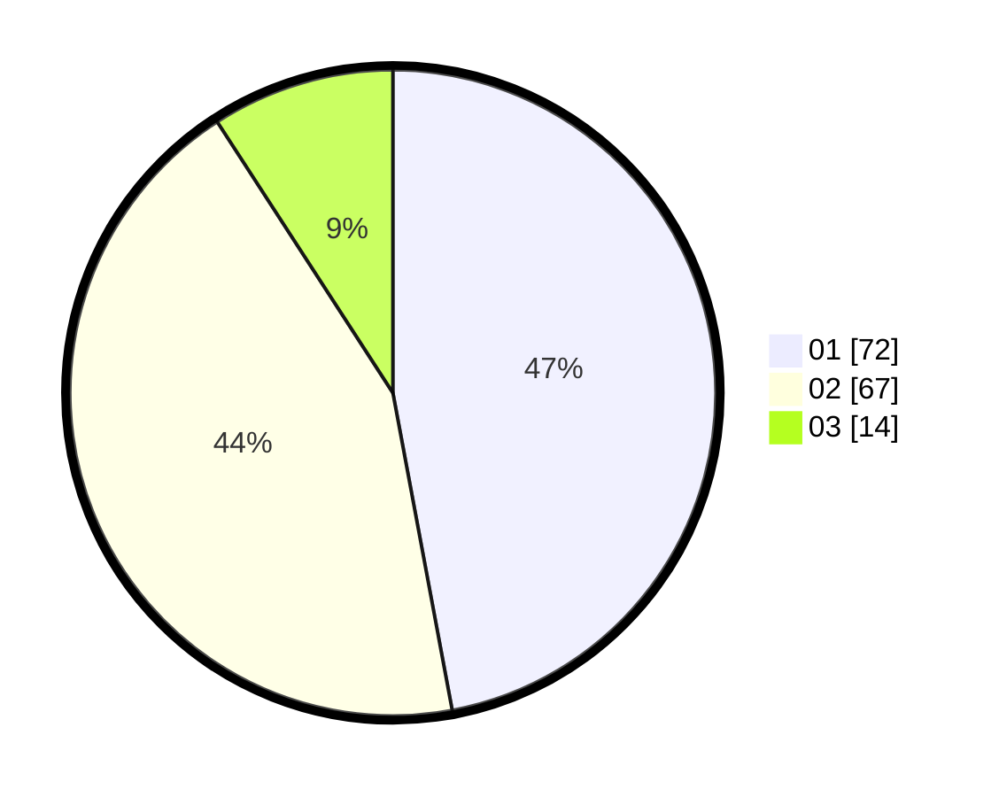

# Hasil

Hasil perolehan suara paslon dapat dilihat pada file paslon-01.txt, paslon-02.txt, dan paslon-03.txt.

Jika tidak ada, artinya data tersebut belum ada pada SIREKAP.

## Perolehan Suara

 * Paslon 01: **72**.
 * Paslon 02: **67**.
 * Paslon 03: **14**.

## Foto C Plano

https://sirekap-obj-formc.kpu.go.id/03f8/pemilu/ppwp/31/73/06/10/01/3173061001096-20240214-155521--ae2cc504-5602-4373-a318-2cf2ced4c7ea.jpg

https://sirekap-obj-formc.kpu.go.id/03f8/pemilu/ppwp/31/73/06/10/01/3173061001096-20240214-201240--48e14e44-d5a2-4b83-86cd-955186a70aed.jpg

https://sirekap-obj-formc.kpu.go.id/03f8/pemilu/ppwp/31/73/06/10/01/3173061001096-20240214-155403--518011f1-0b4b-4dd2-a10a-a8ecebabe8ed.jpg

## DATA PEMILIH TETAP

Jumlah pemilih dalam DPT: **225**.
 * L: **113**.
 * P: **112**.

## DATA PENGGUNA HAK PILIH

Jumlah pengguna hak pilih dalam DPT: **156**.
 * L: **78**.
 * P: **78**.

Jumlah pengguna hak pilih dalam DPTb: **0**.
 * L: **0**.
 * P: **0**.

Jumlah pengguna hak pilih dalam DPK: **0**.
 * L: **0**.
 * P: **0**.

Jumlah pengguna hak pilih: **156**.
 * L: **78**.
 * P: **78**.

## JUMLAH SUARA SAH DAN TIDAK SAH

JUMLAH SELURUH SUARA SAH: **153**.

JUMLAH SUARA TIDAK SAH: **3**.

JUMLAH SELURUH SUARA SAH DAN SUARA TIDAK SAH: **156**.
