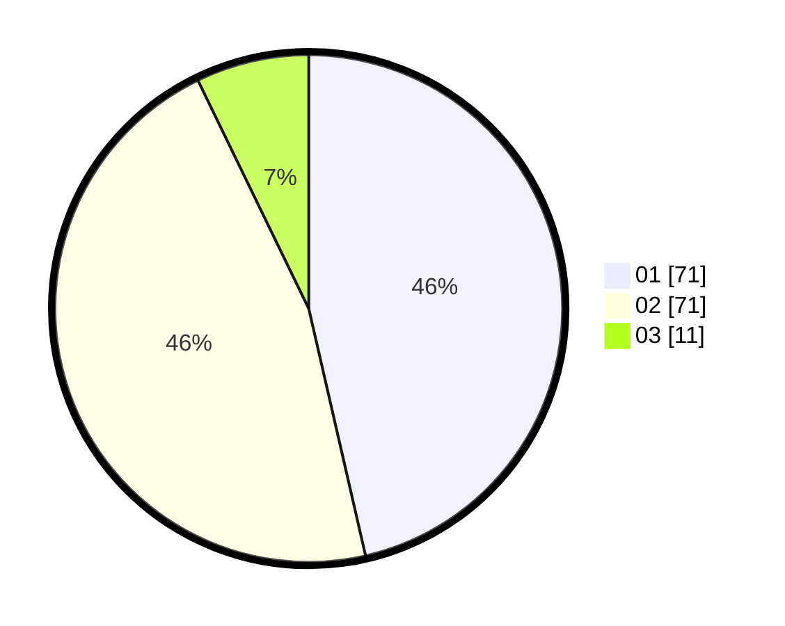

# Hasil

Hasil perolehan suara paslon dapat dilihat pada file paslon-01.txt, paslon-02.txt, dan paslon-03.txt.

Jika tidak ada, artinya data tersebut belum ada pada SIREKAP.

## Perolehan Suara

 * Paslon 01: **71**.
 * Paslon 02: **71**.
 * Paslon 03: **11**.

## Foto C Plano

https://sirekap-obj-formc.kpu.go.id/df17/pemilu/ppwp/31/73/06/10/01/3173061001098-20240216-095550--d41262e5-21d0-4c94-9391-90d2c594473a.jpg

https://sirekap-obj-formc.kpu.go.id/df17/pemilu/ppwp/31/73/06/10/01/3173061001098-20240214-193009--9002ed0a-08a8-4d83-9d69-cf9a69c980ee.jpg

https://sirekap-obj-formc.kpu.go.id/df17/pemilu/ppwp/31/73/06/10/01/3173061001098-20240216-095550--3a85a08b-adcb-460f-9dea-f757394c1780.jpg

## DATA PEMILIH TETAP

Jumlah pemilih dalam DPT: **194**.
 * L: **103**.
 * P: **91**.

## DATA PENGGUNA HAK PILIH

Jumlah pengguna hak pilih dalam DPT: **154**.
 * L: **77**.
 * P: **77**.

Jumlah pengguna hak pilih dalam DPTb: **1**.
 * L: **1**.
 * P: **0**.

Jumlah pengguna hak pilih dalam DPK: **1**.
 * L: **1**.
 * P: **0**.

Jumlah pengguna hak pilih: **156**.
 * L: **79**.
 * P: **77**.

## JUMLAH SUARA SAH DAN TIDAK SAH

JUMLAH SELURUH SUARA SAH: **153**.

JUMLAH SUARA TIDAK SAH: **3**.

JUMLAH SELURUH SUARA SAH DAN SUARA TIDAK SAH: **156**.
