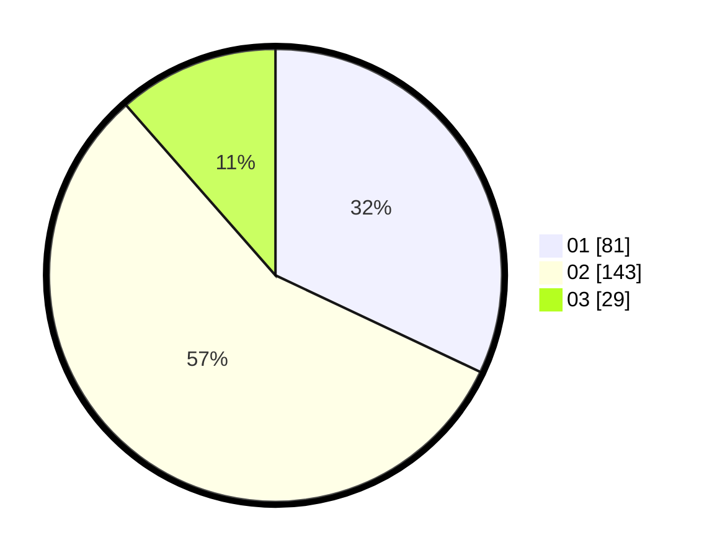

# Hasil

Hasil perolehan suara paslon dapat dilihat pada file paslon-01.txt, paslon-02.txt, dan paslon-03.txt.

Jika tidak ada, artinya data tersebut belum ada pada SIREKAP.

## Perolehan Suara

 * Paslon 01: **81**.
 * Paslon 02: **143**.
 * Paslon 03: **29**.

## Foto C Plano

https://sirekap-obj-formc.kpu.go.id/5e9f/pemilu/ppwp/31/73/06/10/01/3173061001106-20240215-000711--8ff69636-cee2-4280-b375-2bc0a92a6d1a.jpg

https://sirekap-obj-formc.kpu.go.id/5e9f/pemilu/ppwp/31/73/06/10/01/3173061001106-20240215-001004--b7eb5a3f-009f-47fa-8660-2727bd7f17a9.jpg

https://sirekap-obj-formc.kpu.go.id/5e9f/pemilu/ppwp/31/73/06/10/01/3173061001106-20240215-000957--52774721-ff83-44a3-a119-1d1378dfdd40.jpg
