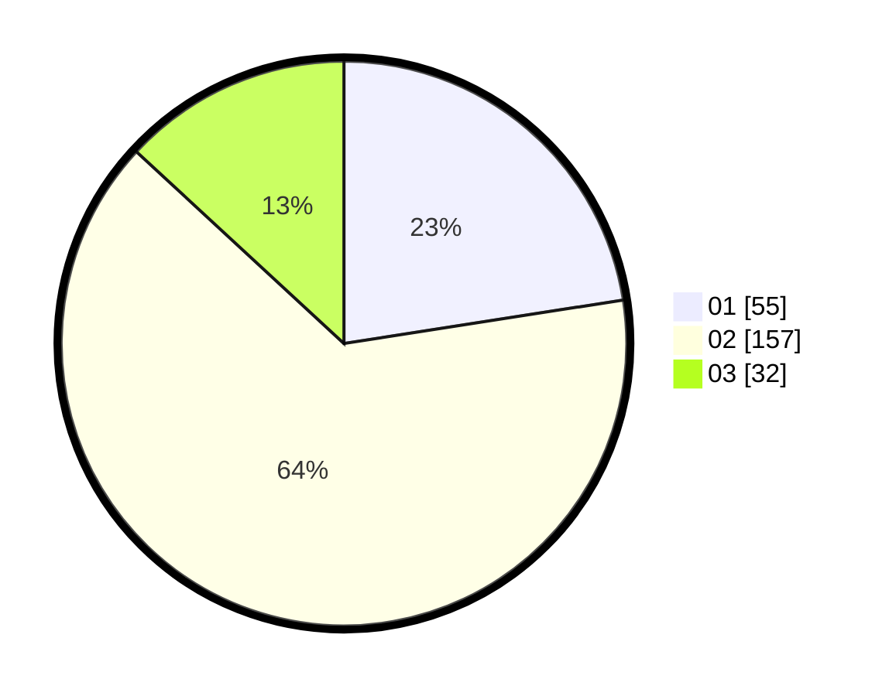

# Hasil

Hasil perolehan suara paslon dapat dilihat pada file paslon-01.txt, paslon-02.txt, dan paslon-03.txt.

Jika tidak ada, artinya data tersebut belum ada pada SIREKAP.

## Perolehan Suara

 * Paslon 01: **55**.
 * Paslon 02: **157**.
 * Paslon 03: **32**.

## Foto C Plano

https://sirekap-obj-formc.kpu.go.id/46ec/pemilu/ppwp/31/73/06/10/01/3173061001112-20240216-023150--4671d26e-9eac-4144-b3fc-9f25924c6d28.jpg

https://sirekap-obj-formc.kpu.go.id/46ec/pemilu/ppwp/31/73/06/10/01/3173061001112-20240216-023150--34b3c0cf-2b79-4d2a-875e-32d52f94ffce.jpg

https://sirekap-obj-formc.kpu.go.id/46ec/pemilu/ppwp/31/73/06/10/01/3173061001112-20240214-155414--ee32188e-f627-4dab-ac71-6df75cba80c7.jpg

## DATA PEMILIH TETAP

Jumlah pemilih dalam DPT: **296**.
 * L: **159**.
 * P: **137**.

## DATA PENGGUNA HAK PILIH

Jumlah pengguna hak pilih dalam DPT: **248**.
 * L: **129**.
 * P: **119**.

Jumlah pengguna hak pilih dalam DPTb: **0**.
 * L: **0**.
 * P: **0**.

Jumlah pengguna hak pilih dalam DPK: **1**.
 * L: **0**.
 * P: **1**.

Jumlah pengguna hak pilih: **249**.
 * L: **129**.
 * P: **120**.

## JUMLAH SUARA SAH DAN TIDAK SAH

JUMLAH SELURUH SUARA SAH: **244**.

JUMLAH SUARA TIDAK SAH: **5**.

JUMLAH SELURUH SUARA SAH DAN SUARA TIDAK SAH: **249**.
