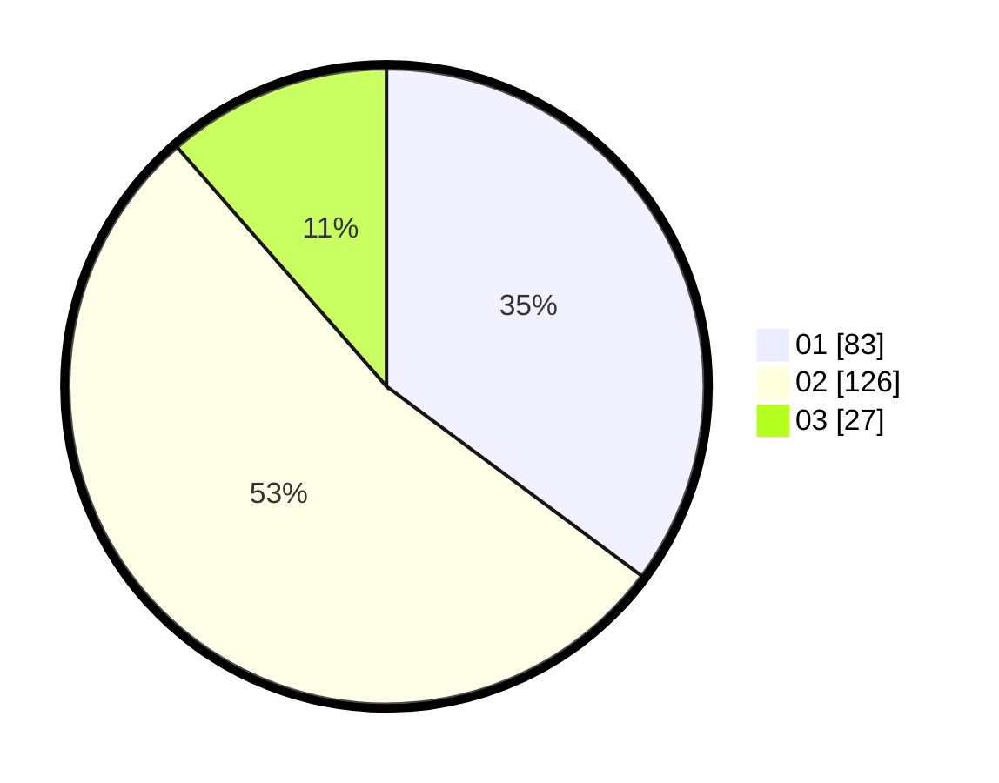

# Hasil

Hasil perolehan suara paslon dapat dilihat pada file paslon-01.txt, paslon-02.txt, dan paslon-03.txt.

Jika tidak ada, artinya data tersebut belum ada pada SIREKAP.

## Perolehan Suara

 * Paslon 01: **83**.
 * Paslon 02: **126**.
 * Paslon 03: **27**.

## Foto C Plano

https://sirekap-obj-formc.kpu.go.id/cf90/pemilu/ppwp/31/73/06/10/01/3173061001115-20240214-220524--d7512b48-95d2-4f9f-9a19-d6e76de15318.jpg

https://sirekap-obj-formc.kpu.go.id/cf90/pemilu/ppwp/31/73/06/10/01/3173061001115-20240214-220618--771f4cb6-5a48-467c-97d5-237f699d2615.jpg

https://sirekap-obj-formc.kpu.go.id/cf90/pemilu/ppwp/31/73/06/10/01/3173061001115-20240214-220659--31d61883-b091-4d36-a32f-8e67dd34508d.jpg
