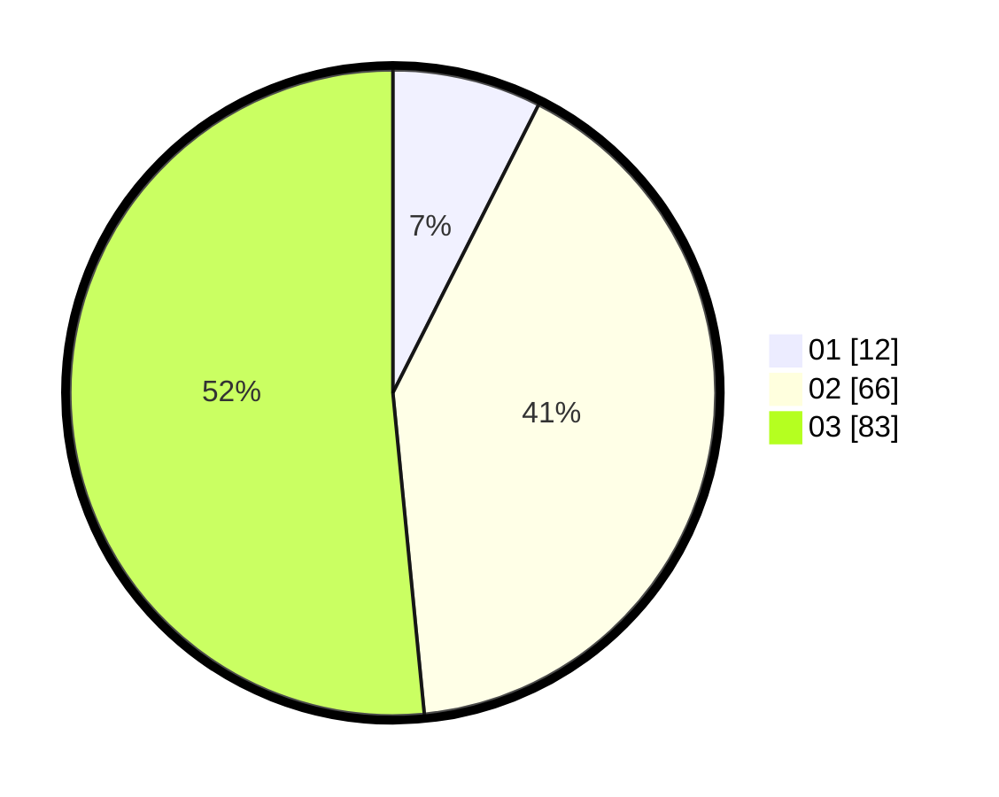

# Hasil

Hasil perolehan suara paslon dapat dilihat pada file paslon-01.txt, paslon-02.txt, dan paslon-03.txt.

Jika tidak ada, artinya data tersebut belum ada pada SIREKAP.

## Perolehan Suara

 * Paslon 01: **12**.
 * Paslon 02: **66**.
 * Paslon 03: **83**.

## Foto C Plano

https://sirekap-obj-formc.kpu.go.id/c8b8/pemilu/ppwp/31/73/06/10/01/3173061001118-20240215-211828--d33c55de-2497-4e94-895b-e78b014d3d1d.jpg

https://sirekap-obj-formc.kpu.go.id/c8b8/pemilu/ppwp/31/73/06/10/01/3173061001118-20240215-211830--37ea34b0-11cc-464e-a3fa-216d4ed18a64.jpg

https://sirekap-obj-formc.kpu.go.id/c8b8/pemilu/ppwp/31/73/06/10/01/3173061001118-20240215-211829--f988ccba-e058-4b93-8e35-d8bfe4e0a69e.jpg

## DATA PEMILIH TETAP

Jumlah pemilih dalam DPT: **202**.
 * L: **103**.
 * P: **99**.

## DATA PENGGUNA HAK PILIH

Jumlah pengguna hak pilih dalam DPT: **156**.
 * L: **73**.
 * P: **83**.

Jumlah pengguna hak pilih dalam DPTb: **6**.
 * L: **1**.
 * P: **5**.

Jumlah pengguna hak pilih dalam DPK: **3**.
 * L: **1**.
 * P: **2**.

Jumlah pengguna hak pilih: **165**.
 * L: **75**.
 * P: **90**.

## JUMLAH SUARA SAH DAN TIDAK SAH

JUMLAH SELURUH SUARA SAH: **161**.

JUMLAH SUARA TIDAK SAH: **4**.

JUMLAH SELURUH SUARA SAH DAN SUARA TIDAK SAH: **165**.
