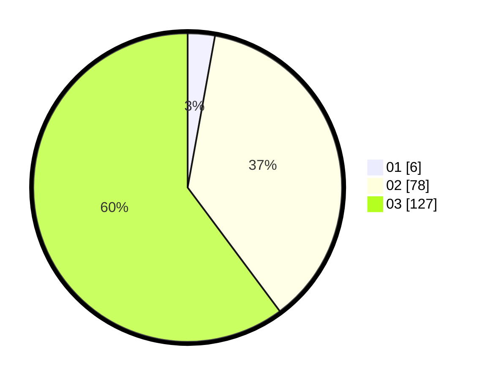

# Hasil

Hasil perolehan suara paslon dapat dilihat pada file paslon-01.txt, paslon-02.txt, dan paslon-03.txt.

Jika tidak ada, artinya data tersebut belum ada pada SIREKAP.

## Perolehan Suara

 * Paslon 01: **6**.
 * Paslon 02: **78**.
 * Paslon 03: **127**.

## Foto C Plano

https://sirekap-obj-formc.kpu.go.id/5cc1/pemilu/ppwp/31/73/06/10/01/3173061001123-20240215-211936--bec3d662-71ed-4d7c-99be-4d1c79b0656a.jpg

https://sirekap-obj-formc.kpu.go.id/5cc1/pemilu/ppwp/31/73/06/10/01/3173061001123-20240214-192544--742fb796-bf92-46cd-b791-44683e0cb4d2.jpg

https://sirekap-obj-formc.kpu.go.id/5cc1/pemilu/ppwp/31/73/06/10/01/3173061001123-20240214-192141--2c927015-a808-41eb-9d99-a395411de788.jpg

## DATA PEMILIH TETAP

Jumlah pemilih dalam DPT: **277**.
 * L: **129**.
 * P: **148**.

## DATA PENGGUNA HAK PILIH

Jumlah pengguna hak pilih dalam DPT: **209**.
 * L: **99**.
 * P: **110**.

Jumlah pengguna hak pilih dalam DPTb: **2**.
 * L: **0**.
 * P: **2**.

Jumlah pengguna hak pilih dalam DPK: **3**.
 * L: **1**.
 * P: **2**.

Jumlah pengguna hak pilih: **214**.
 * L: **100**.
 * P: **114**.

## JUMLAH SUARA SAH DAN TIDAK SAH

JUMLAH SELURUH SUARA SAH: **211**.

JUMLAH SUARA TIDAK SAH: **3**.

JUMLAH SELURUH SUARA SAH DAN SUARA TIDAK SAH: **214**.
